## 第一章

### 1. 操作系统的基本概念、组成、功能和原理

- **基本概念**：操作系统是管理计算机==硬件与软件==资源的程序，是用户与计算机硬件之间的接口。它是系统软件的核心，处于最底层地位。其设计目标包括方便性、有效性（提高资源利用率）、可扩充性和开放性。 ^y7s1oy
- **系统组成**：主要由内核（负责进程、内存、设备驱动、文件和网络管理）、外壳（如Shell，作为用户与内核交互的接口）、文件系统（管理磁盘文件）以及运行在其上的应用程序四部分组成。
- **主要功能**：涵盖五大管理功能，即进程管理（调度、同步、死锁处理）、存储管理（内存分配回收、虚拟内存）、设备管理（缓冲、驱动）、文件管理（存储空间、目录、读写保护）以及用户接口（CLI、API、GUI）。
- **基本原理**：核心机制包括中断与系统调用（实现用户态与内核态切换）、并发与共享（多道程序设计下的资源互斥同步）以及虚拟技术（虚拟处理器与虚拟内存的实现）。
### 2. Linux 系统的发展历程、特点、应用现状和前景
- **发展历程**：Linux基于Unix开发并遵循POSIX标准，由林纳斯·托瓦兹于1991年发布首个版本（0.01版），吉祥物为企鹅Tux。它遵循GNU通用公共许可证（GPL），属于自由开源软件。完整的Linux系统由Linux内核、GNU软件及其他应用软件共同组成。
- **主要特点**：具有开放性（源码公开、遵循标准）、多用户多任务、良好的用户界面（支持Shell与GUI）、设备独立性（一切皆文件）、丰富的网络功能、可靠的系统安全（权限与审计）以及良好的可移植性（跨硬件平台）。
- **应用现状**：在服务器领域（Web、数据库、云平台）占据主流；广泛应用于嵌入式领域（Android、路由器、车载）；全球Top500超级计算机几乎全部运行Linux；在个人桌面端虽份额较小但在开发者群体中广泛使用。
- **发展前景**：作为云计算与大数据基础设施的核心地位稳固；随着物联网爆发，其轻量化优势进一步凸显；在中国，基于Linux的国产操作系统（如麒麟、统信UOS）正加速在政企领域的国产化替代进程。 
### 1. 操作系统概述
1. 计算机是由硬件和软件组成
2. 软件是用户和计算机硬件之间的接口和桥梁（Linux==操作系统==就是软件的一类）
3. 操作系统的作用：
	作为用户和计算机硬件之间的桥梁，[调度和管理计算机硬件进行工作](调度和管理计算机硬件进行工作.md)
### 2. 初识Linux
 1. 创始人：林纳斯-托瓦兹 1991 服务器操作系统
 2. 组成：系统的内核和系统级的应用程序
	 - 内核其实就提供了系统最核心的功能，比如我们在前面所说的调度硬件的能力其实就是由内核提供的，比如我们的内核可以调度CPU、调度内存、调度文件、系统调度、网络通讯、调度、io等等啊这一系列和硬件的交互的功能都是由内核所提供的
	 - 内核并不是给我们普通人去使用的，那当我们去使用操作系统的时候，肯定都会使用一系列的软件，那所以一个完整的系统的话，除了有内核以外，还会有一些系统级的应用程序，那么你可以理解为出厂自带程序可以帮助我们用户呢快速的去上手操作系统。
 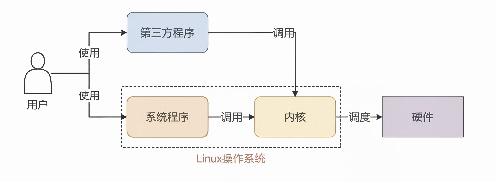
 3. 如图：对于一个用户来说，我们使用系统其实本质上来说是使用系统里面的各类程序，不管是系统自带的，还是说你后期第三方安装的，我们总归都是使用程序，然后最终由程序去调用我们的内核，然后由内核去调度我们的硬件去工作。
 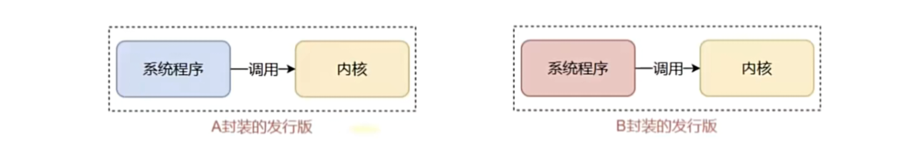
4. 谁都可以封装Linux发行版（自己提供系统程序）

5. 多数以命令行的形式来操作Linux系统
### 3. 虚拟机
 1. 在我们的电脑中通过一系列的虚拟化的软件，然后得到虚拟的硬件，最后呢给虚拟的硬件安装真实的操作系统，那么我们就得到一个虚拟出来的完整的电脑
2. 虚拟化技术_虚拟软件→虚拟硬件→安装真实的操作系统
### 4. 系统运行级别
Linux 运行级别 CentOS 6：
	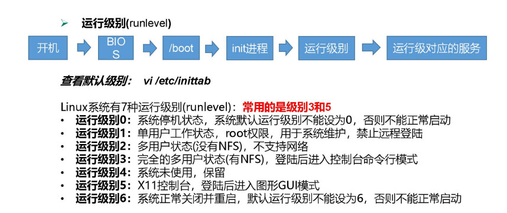
CentOS7 的运行级别简化为:
- **==multi-user.target** 等价于原运行级别 3（多用户有网，无图形界面）==（就是开机时的那个黑屏） 
- ==**graphical.target** 等价于原运行级别 5（多用户有网，有图形界面）==（常用的命令行）
## 第二章
### 1. Linux目录结构
1. ==采用级层式==的树形结构
2. Windows系统可以有多个盘符，c盘和d盘等，**而Linux系统没有盘符这个概念只有一个根目录==“/”==所有的文件都在它的下面**
3. Linux的各个目录存放的内容是规划好，不用乱放文件。各个文件目录下存放什么内容，必须有一个认识。
4. Linux是以==文件的形式管理我们的设备==，因此linux系统，一切皆为文件。
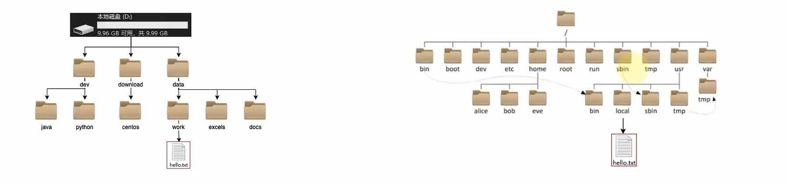
对于左图D:\data\work\hello.txt D表示d盘，\表示层级关系
对于右图/usr/local/hello.txt 开头的/表示根目录，后面的/表示层级关系
####  目录用途(可以修改的目录：/tmp，/opt，/home，/root(当自己是root用户时)，/var，/media，/mnt)
* ==`/bin：`== 是Binary的缩写，这个目录存放着最经常使用的命令。/usr/bin
* ==`/sbin`==：s就是Super User的意思，这里存放的是系统管理员使用的系统管理程序。
* `/home：`存放普通用户的主目录，在Linux中每个用户都有一个自己的目录，一般该目录名是以用户的账号命名的。
* `/root：`该目录为系统管理员，也称作超级权限者的用户主目录。
* ==`/lib`==：library，==系统开机所需要最基本==的动态连接共享库，其作用类似于Windows里的DLL文件。几乎所有的应 用程序都需要用到这些共享库。
* /lost+found：这个目录一般情况下是空的，当系统非法关机后，这里就存放了一些文件。
* `/etc`(谨慎操作）：所有的==系统管理所需要的配置文件和子目录==my.conf。
* `/usr/local`：这是一个非常重要的目录，用户的很多应用程序和文件都放在这个目录下，类似与windows下的program files目录。
* ==`/boot：`==存放的是==启动Linux时使用的一些核心文件==，包括一些连接文件以及镜像文件。
* ==`/proc`==：这个目录是一个虚拟的目录，它是系统内存的映射，访问这个目录来获取系统信息。
* ==/srv==：service的缩写，该目录存放一些服务启动之后需要提供的数据。
* ==/sys==：这是linux2.6内核的一个很大的变化。该目录下安装了2.6内核中新出现的一个文件系统sysfs。
* `/tmp`：这个目录是用来存放一些临时文件的。
* ==`/dev`==：类似windows的设备管理器，把所有的硬件用文件的形式存储。
* `/media：`linux系统会自动识别一些设备，例如U盘光驱等等，当识别后，linux会把识别的设备挂载到这个目录下。
* `/mnt：`系统提供该目录是为了让用户临时挂载别的文件系统的，我们可以将外部的存储挂载在/mnt/上，然后进入该目录就可以查看里面的内容了。
* `/opt：`==这是给主机额外安装软件所摆放的目录==，如安装ORACLE数据库就可放到该目录下。默认为空。
* `/usr/local`：这是另一个给主机额外安装软件所安装的目录，一般是通过编译源码的方式安装的程序。
* `/var：`这个目录中存放着在不断扩充着的东西，习惯将经常被修改的目录放在这个目录下，包括各种日志文件。
* `/selinux`：SELinux是一种安全子系统，它能控制程序只能访问特定文件。
### 硬件
| 硬件设备             | 文件名称                                                     |
| ---------------- | -------------------------------------------------------- |
| ==IDE设备==        | ==/dev/hd[a-d]，现在的 IDE设备已经很少见了，因此一般的硬盘设备会以 /dev/sd 开头。== |
| ==SCSI/SATA/U盘== | ==/dev/sd[a-p]，一台主机可以有多块硬盘，因此系统采用 a~p 代表 16 块不同的硬盘。==    |
| 软驱               | /dev/fd[0-1]                                             |
| 打印机              | /dev/lp[0-15]                                            |
| 光驱               | /dev/cdrom                                               |
| 鼠标               | /dev/mouse                                               |
| 磁带机              | /dev/st0 或 /dev/ht0                                      |
### 2. Linux命令基础
1. 命令：Linux操作的指令，是系统内置的程序，可以以字符化的形式去使用。
2. 命令行：Linux的终端（terminal），提供字符化的操作页面，使命令得以执行。
#### 2.1 Linux命令基础格式：
``` bash
command [ -options ] [ parameter ]
```
- command 命令本身
- -options （可选 ）命令的一些选项，可以通过命令的选项控制命令的行为细节（用于调整命令功能），==选项的顺序可以是随意。==
- parameter 可选 命令的参数，多用于命令的指向目标（对象）等
- ==文件路径一般在命令最后==
例如：
```bash
ls -l /home/xy
ls是命令本体，-l是选项，路径是参数，作用是以列表形式显示指定路径下的内容
```
### 帮助命令
1. `man` 用来显示某个命令的文档信息。比如：`man ls`
2. `--help` 很多命令通过参数`--help`提供非常简短的帮助信息。
- 内置命令 and 外部命令 `用type 命令名`判断，内嵌外置相对于shell来说的，使用type如果是内置，就会显示内嵌，不是就是外置。
- man可以查出外置命令，如果是内置命令，需要`man -f 命令名`或者内置命令的help命令  `help 命令名`。另外可以`外置命令名  -- help`
- 在终端里，输入`ca`，然后快速按2次`<TAB>`键盘，命令行会进入补全模式，显示以ca打头的所有命令。
### 3. ls命令

ls命令的作用是列出目录下的内容
```bash
ls [-a -l -h]  [linux路径]（注意之间有空格）
```

- -a -l -h是==可选==的选项
- Linux路径是此命令的==可选==参数
当不使用选项和参数，直接使用ls命令本体，表示：以==平铺==的形式，列出当前工作目录（默认HOME目录）下的内容（文件或文件夹）

#### 3.1 HOME目录和工作目录
Linux系统命令行终端，在启动的时候，默认加载：
- HOME目录：每个Linux操作用户在Linux系统的==个人账户目录==，路径：/home/用户名
-->/home/**==xy==**
- HOME目录默认作为当前工作目录，Windows和Linux都有用户的HOME目录 
- 工作目录：Linux命令在执行的时候，需要一个工作目录。
#### 3.2 ls命令的参数和选项
1. ls命令的参数的作用：可以指定要查看的文件夹（目录）的内容，如果不给定参数，就查看当前工作目录的内容，==默认 /home/xy==
2. ls命令的选项：
	- -a选项 （all）展示目录下的所有内容-->文件名前以 ==.== 开头的表示Linux系统下的隐藏文件/文件夹。所以需要-a才能显示出来;
	- -l选项 （list）以列表的形式展示工作目录下的内容，并展示更多细节;
	- -h选项 （human？）需要和-l选项搭配使用，以更加人性化的方式显示文件的大小单位（不用-h默认大小以byte作为单位）;
3. 命令的选项组合使用：比如ls -lah（lah的顺序是任意的），等同于ls -a -l -h;

### 4. cd/pwd 目录切换相关命令
1. cd（change directory)命令的作用
	- 切换当前工作目录，语法： cd Linux路径
		- 没有选项。只有参数，表示目标路径
		- 使用参数，切换到指定路径
		- 不适用参数，切换工作目录到当前用户的HOME-->==/home/xy==
2. pwd（print work directory）命令的作用
	- 输出当前所在的工作目录，语法： pwd
	- 没有选项，没有参数，直接使用即可

### 5. 相对路径、绝对路径、特殊路径符
1. 相对路径：以根目录作为起点，描述路径的方式，路径由 / 开头
2. 绝对路径：以当前目录作为起点，描述路径的方式，路径==不需要以 / 开头==（常用)
==当已处在/home/xy路径下时，在输入cd Desktop时，路径变为：/home/xy/Desktop==
#### 5.1 特殊路径符：
- . 表示当前目录，比如 cd ./Desktop
	==本质上是相对路径==
- .. 表示上一级目录，比如cd ..或返回上一级的上一级 cd ../..
	==本质上是相对路径==
- ~ 表示用户的HOME目录，比如cd ~或cd ~/Desktop（~=/home/xy，==这是xy的HOME目录==)
	==本质上是绝对路径==
### 6. mkdir命令
1. mkdir命令的语法和功能
	- mkdir用来创建新的==目录==（文件夹）
	- 语法：
		``` bash
		  	mkdir [-p] linux路径
		```
		命令参数==必填==，表示要创建的路径，相对、绝对、特殊路径符都可以使用
2. -p（parent）选项的作用：==可选==，表示可以创建不存在的父目录，适用于创建连续的**多层级**的目录
ps：Ctrl+l-->清空命令行
### 7. touch、cat、more命令
#### 7.1 touch（下面的vim也行）
- 用于创建一个新==文件==(类似于.txt文档，之后可编辑，可不加后缀txt等)
- 语法
``` bash
touch linux文件路径
```
- 参数必填，表示创建文件的路径，相对，绝对，特殊路径符都可以使用
#### 7.2 cat
- 用于查看文件内容，一次性展示所有内容
- 语法
``` bash
cat linux文件路径
```
- 参数必填，表示创建文件的路径，相对，绝对，特殊路径符都可以使用
#### 7.3 more
- 用于查看文件内容，可翻页查看（空格），使用q退出查看
- 语法
``` bash
more linux文件路径
```
- 参数必填，表示创建文件的路径，相对，绝对，特殊路径符都可以使用

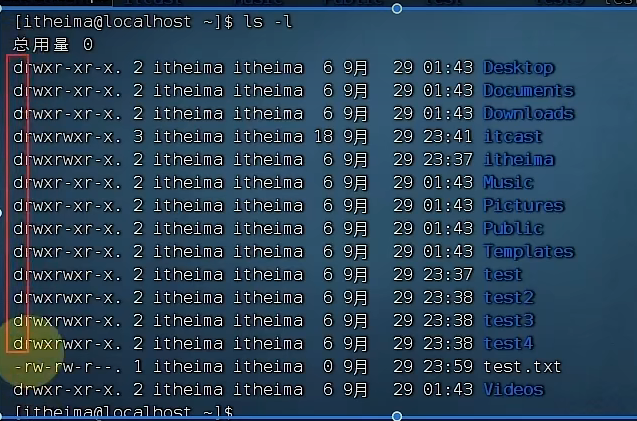
ps：以d开头的都是文件夹，以- 开头的都是文件

### 8. cp、mv、rm命令

#### 8.1 cp命令（copy）
- 用于复制文件或文件夹 ^20e9f9
- 语法：
``` bash
cp [ -r ] 参数1 参数2
```
- -r选项，可选，用于复制文件夹，表示递归。复制文件就不用这个选项了
- 参数1，Linux路径，表示要被复制的文件或文件夹。参数2，Linux路径，表示要复制去的地方
-->1被复制到2中去
#### 8.2 mv命令（move）
- 用于移动文件或文件夹
- 语法：
``` bash
mv 参数1 参数2
```
- ==无选项==
- 参数1，Linux路径，表示要被移动的文件或文件夹。参数2，Linux路径，表示移动去的地方，==如果目标不存在==，则进行改名。（改名是在原路径下改的）
#### 8.3 rm（remove）
- 用于删除文件或文件夹
- 语法
``` bash
rm [ -r -f ] 参数1 参数2···参数n
```
- -r 选项，可选，用于删除文件夹==（只要有文件夹，就要用）==。 -f选项，可选，用于强制删除（不提示，一般用于root用户）
- 参数，删除文件或文件夹的路径，支持多个。路径与路径间用空格隔开
- ==参数支持通配符 \*== ，用来做模糊匹配（test *   * test   * test * ）
### 9. find和which命令
#### 9.1 which
- 查找命令的程序文件
- 语法：
``` bash
which 要查找的命令
```
- 无需选项，只需要参数表示查找哪个命令
#### 9.2 ==find==
- 用于查找指定的文件
- 语法：
``` bash
文件名查找
find 起始路径 -name "被查找文件名" #双引号
文件大小查找
find 起始路径 -size +|-n[k/M/G]
举例
find / -name "*text*"
#找小于10kb的文件
find / -size -10k (k是小写字母)
```
- 支持==通配符==查找
### 10. echo、tail、重定向符
#### 10.1 echo命令
- 在命令行里输出指定的内容
- 语法：
``` bash
echo "输出的内容" #双引号
```
- 无需选项，只要一个参数，表示输出的内容

反引号符==（配合echo使用）==：被 \` 包围的内容，会被作为命令执行，而非普通字符
例如 echo \`pwd\`-->输出当前路径内容
#### 10.2 tail命令
- 查看文件尾部的内容，并可以持续跟踪（Ctrl+c终止跟踪）
- 语法：
``` bash
tail [-f -num] liunx文件路径
# -f（follow)
```
- num默认是10,看尾部num行，内容顺序不变
#### 10.3 重定向符
-  > 将左侧命令的结果==覆盖==写入“>”右侧指定的文件中（覆盖是指先删除再写入）
-  >> 将左侧命令的内容==追加==写入">>"右侧指定的文件中
### 11. grep、wc、管道符
#### 11.1 grep
- 从文件中通过关键字过滤文件==行==
- 语法
``` bash
 grep [ -n ] 关键字 文件路径
 在目标文件目录下，可以直接 grep 关键字
```
- 选项-n ，可选，表示在结果中是否显示匹配的行的行号
- 参数 关键字，必填，表示过滤的关键字，建议使用“ ”将关键字包围起来
- 参数 文件路径，必填，表示要过滤内容的文件路径。不填时，可作为管道符的输入
- ==不需要用通配符==，直接过滤
#### 11.2 wc
- 统计文件的行数、单词数、字节数、字符数
- 语法：
``` bash
wc [ -c -m -l -w ] 文件路径
```
- 不带选默认统计==行数，单词数，字节数==（文件信息）
- -c 字节数（char)、-m字符数、-l行数(line)、-w单词数（word）==这个统计的是一行所有的单词数==，不是某个单词数，以==空格==数来判断
- 参数，被统计文件的文件路径，不填时，可作为管道符的输入
#### 11.3 管道符
- 将 | 左边的命令的结果，作为右边命令的输入
如：ls(有输出的命令) | grep ctf (找到当前目录下的ctf)
### 12. vi/vim编辑器
1. vim是vi的加强版，就是命令行模式下的文本编辑器，用来编辑文件
2. 语法：
``` bash
 vi 文件路径
 vim 文件路径
 
 文件路径不存在时，会新建一个文件
```
3. 运行模式：
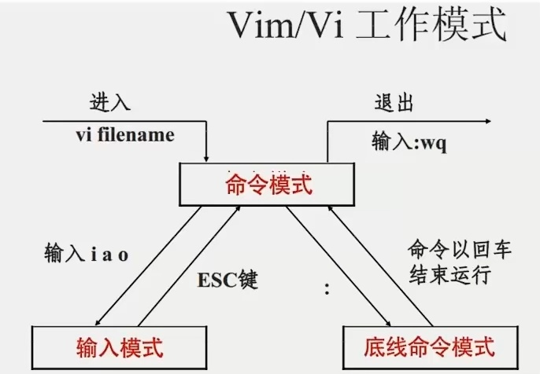
	-  命令模式：默认，可以通过快捷键控制文件内容，==主要是进行删除，复制，粘贴==
	-  输入模式：命令模式进入，==主要编辑文件内容==，插入的字符在光标之前
	- 底线命令模式：命令模式进入，对整个文件操作，可以对文件进行保存、关闭操作
4. 命令模式下的快捷键（在vim命令模式下，vim的底部会显示相应的操作）：
	- u 撤销
	- ==ctrl+r 反向撤销==
	
	-----------------------------------------------------------------------------------------------
	- dd 删除光标在的行(5dd:删除包括当前行的后5行)
	- ==dw删除光标到第一个空格的所有内容==
	- ==d$，d\^== 
	- d0 删除光标前的这一行的东西（不包括光标） -->d$ 删除光标后的这一行的东西（包括光标）
	- dG 删除从这一行开始的后所有行 -->dgg 删除从这一行开始的前所有行

	-----------------------------------------------------------------------------------------------
	- ==yy 复制当前行。 -->p 粘贴复制的内容（5yy/y5y/yy5：包括当前行复制了5行，5p：把复制的内容粘贴5次）==
	- ==y$ 复制当前行光标到行末的所有内容，y^ 复制当前行光标到行首的所有内容==
	
	-----------------------------------------------------------------------------------------------
	- ==小写的x，表示剪切光标的一个字符，剪切后光标向右移动（可以当成删除使用）。大写的X表示剪切光标的一个字符，剪切后光标向左移动（可以当成删除使用）。==
	- ==小写的r，对光标上的单个字符进行替换。==
	- ==大写的R，进入替换模式，替换一系列字符==
	
	-----------------------------------------------------------------------------------------------
	- ==gg 光标跳到文章首行 -->G光标跳到文章尾行==
	- ^ 光标移动到行头。$ 光标移动到行尾
	- w 按照一个单词移动，从一个单词词头到下一个单词词头
	- e 按照一个单词移动，从一个单词词尾到下一个单词词尾
	- b 按照一个单词移动，从一个单词词尾到上一个单词词尾
	
	-----------------------------------------------------------------------------------------------
	- i键 进入输入模式 -->Esc 退出输入模式进入命令模式
	- 数字0 到光标所在行的前面 -->I 到光标所在行的前面并进入输入模式
	- $键 到光标所在行的后面-->A 到光标所在行的后面并进入输入模式
	- ==o键 到光标所在行的下一行进入输入模式（重新开一行）--> O键 到光标所在行的上一行进入输入模式（重新开一行）==（行之间插入）
5. 底线命令模式下的快捷键：
	- ：set nu  显示行号 -->：set nonu 取消行号
	- gg 光标跳到文章首行 -->G光标跳到文章尾行。5g表示跳到第5行的行首
	-   ！:键 进入底线命令模式-->wq 保持并退出底线命令模式，进入命令模式（：q）
	- / 键进入搜索模式-->n是向下继续搜索，N向上进行搜索-->：noh 取消高亮

### Emacs
#### 一、 Emacs 界面五大区域 (基础认知)

Emacs 的界面从上到下分为 5 个部分，考试常考“模式行”和“回显行”的区别：

1. **标题栏**：显示 GNU Emacs 信息及当前打开的文件名。
2. **菜单栏**：提供下拉菜单，带 `...` 的表示需要输入参数。
3. **窗口区域**：主要的文本编辑区。
4. **模式行 (Mode Line)**：【**重点**】倒数第二行，显示当前缓冲区的状态信息（如文件名、光标位置、修改状态、主模式等）。
5. **回显行 (Echo Area)**：【**重点**】屏幕最后一行，用于显示提示信息、错误信息，或作为“小缓冲区”让用户输入命令参数（如文件名）。

---

#### 二、 核心快捷键与命令 (必考重点)

Emacs 的命令通常是组合键，最常见的修饰键是 `Ctrl` (书中常写为 `C-`) 和 `Alt` (书中常写为 `M-` 或 Meta)。

##### 1. 文件与缓冲区操作 (最核心)
| 快捷键组合         | 英文命令                       |        含义 / 功能        | 记忆技巧                |
| :------------ | :------------------------- | :-------------------: | :------------------ |
| **`C-x C-s`** | save-buffer                |    **保存当前文件/缓冲区**     | `s` = save (保存)     |
| **`C-x C-w`** | write-file                 |       **另存为文件**       | `w` = write (写入新文件) |
| **`C-x C-c`** | save-buffers-kill-terminal | **退出 Emacs不保存修改后的文件** | `c` = close/quit    |
缓冲区：把真实文件拷贝到内存中的文件区域

| 快捷键组合         | 英文命令                     |      含义 / 功能       | 记忆技巧                 |
| :------------ | :----------------------- | :----------------: | :------------------- |
| **`C-x C-f`** | find-file                |    **搜索并打开文件**     | `f` = file (文件)      |
| **`C-x C-v`** | find-alternate-file      | **打开另一个文件替换当前文件**  | `v` = view (换个视角/替换) |
| **`C-x C-b`** | list-buffers             |    **列出/切换缓冲区**    | `b` = buffer (缓冲区)   |
| **`C-x i`**   | insert-file              |     在光标处插入文件内容     | `i` = insert         |
| **`Alt+X`**   | execute-extended-command | 恢复自动保存的文件 / 执行扩展命令 | 呼出命令输入框              |

##### 2. 光标移动与屏幕滚动

| 快捷键               | 含义                  | 记忆技巧                      |
| :---------------- | :------------------ | :------------------------ |
| **`C-v`**         | **向前移动一屏 (向下翻页)**   | `v` 像向下的箭头                |
| **`Alt+v`**       | 向后移动一屏 (向上翻页)       | 配合 Alt 键反向                |
| `C-f` / `C-b`     | 向前(右) / 向后(左)移动一个字符 | `f`=forward, `b`=backward |
| `C-n` / `C-p`     | 向下 / 向上移动一行         | `n`=next, `p`=previous    |
| `C-a` / `C-e`     | 移动到行首 / 行尾          | `a`=开头, `e`=end           |
| `Alt+f` / `Alt+b` | 向前 / 向后移动一个单词       | 单词级别的 f/b                 |
##### 3. 编辑与撤销
- **撤销修改**：`C-x u` 或 `C-_` (Ctrl+下划线)。
- **取消/中断当前命令**：**`C-g`** (Ctrl+G)。撤销。当输入错误命令或想取消正在输入的参数时，按此键。
---
#### 三、 模式行状态标识 (极易混淆点)

模式行（倒数第二行）最左侧的两个字符，表示缓冲区的**修改状态**，这是考试的绝对重点： ^uijo5p

|   标识符    | 含义                  | 记忆/理解                   |
| :------: | :------------------ | :---------------------- |
| **`--`** | 缓冲区**未被修改** (与磁盘一致) | 平平淡淡，没有变化               |
| **`**`** | 缓冲区**已被修改** (未保存)   | 两个星号，代表有动作发生            |
| **`%%`** | **只读**缓冲区，且**未被修改** | 百分号代表“只读 (Read-Only)”属性 |
| **`%*`** | **只读**缓冲区，但**已被修改** | 既有只读属性(%)，又有修改动作(*)     |

---
#### 四、 其他重要概念补充

1. **区域 (Region) 与 标记 (Mark)**：
    - 选中的一段文字称为“区域”。
    - 区域的起点叫作 **标记 (Mark)**。
    - 光标当前的位置叫作 **点 (Point)**。
    - 区域就是“标记”和“点”之间的文本。
2. **窗口分割**：
    - `C-x 2`：将当前窗口**水平**分割为上下两个窗口。
    - `C-x 3`：将当前窗口**垂直**分割为左右两个窗口。
    - `C-x 0`：删除当前窗口。
    - `C-x 1`：删除当前窗口**外**的所有窗口（即全屏当前窗口）。
3. **帮助系统**：
    - 遇到问题时，按 **`C-h`** (Ctrl+H) 调用 Emacs 的帮助系统。
## 第三章
### 1. Linux的root（超级管理员用户)用户及普通用户
#### 1.1 su命令
- 切换用户（不只是root）
- 语法：
``` bash
su [ - ] [用户名]
```
- - 表示切换后加载环境变量，建议带上
- 用户可以省略，默认为root
#### 1.2 sudo命令
- 让一条普通的命令带有root权限
- 语法：
``` bash
sudo 其他命令
```
- 配置：先切换为root用户，在visudo在其最后一行加入 xy ALL=(ALL)     NOPASSWD:ALL
### 2. 用户和用户组
1. 用户一定在一个用户组中
2. 组不是文件夹
3. Linux用户管理模式：
	- 支持多用户，多用户组、用户可加入多个组
	- Linux权限控制的单元是用户级别和用户组级别
#### 2.1 一些命令（都需要root用户才能执行）
1. 用户组管理
	- 创建用户组：``` groupadd 用户组名```
	- 删除用户组：``` groupdel 用户组名```
2. 用户管理
	2.1 创建用户：
	``` 
	useradd 用户名 [ -g -d ]
	例：useradd test2 -g test -d /home/xy/Desktop/test1
	```
	选项：
		-g 指定用户的组，若不指定，则会创建一个与用户名相同的组，并把该用户加入到该组中。若指定则指定的组必须存在。
		==-d 指定用户的HOME路径==，若不指定，则HOME目录默认在：/home/用户名 
		
		uid:用户名     group：组别
	
	2.2 删除用户：
	``` 
	userdel [ -r ] 用户名
	```
	选项：
		-r 删除用户的home目录，若没-r，则删除用户时，HOME目录会被保留
	
	2.3 查看用户所属组：
	``` 
	id [用户名]
	```
	参数：
		用户名，被查看的用户，如果不写
	
	2.4 修改用户所属组：
	``` 
	usermod -aG 用户组 用户名
	例：usermod -aG test bb
	```
	把 bb 移入test组中
	
	2.5 getent命令：
	``` 
	查用户
	getent passwd
	```
	==不一定要在root权限下才能使用==
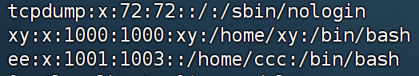
所得信息依次为  用户名：密码（x）：用户ID：组ID：描述信息（无用）：HOME目录：这个用户使用的终端。 ^1u85ce
```
查用户组
getent group
```
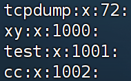
所得信息依次为 组名称：组认证（显示为x）：组ID
### 3. 查看权限控制信息
1. ls -l列出的权限信息：
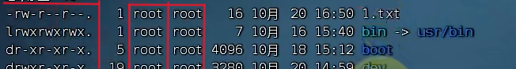
第一部分：表示文件、文件夹的权限信息
第二部分：表示文件、文件夹的所属用户
第三部分：表示文件、文件夹的所属用户组
2. 权限细节解读：
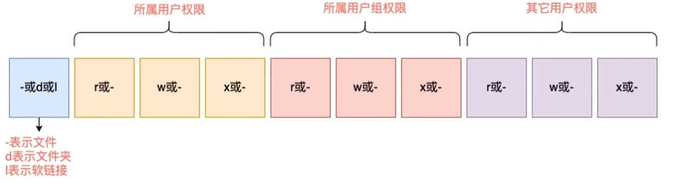
例：对于图片[file-20260706193744920](assets/Linux/file-20260706193744920.png)]中的1.txt文件，文件类型为 -（表示文件），用户为root，其权限是：rw-，用户组为root，其权限是：r--，其他用户如：xy，其权限为：r--
3.rwx分别表示
- r，针对文件可以查看文件内容（cp cat more less tail head grep wc vim）
	- 针对文件夹，可以查看文件夹的内容，如ls命令（ls find）
- w，针对文件可以修改文件内容（echo" "> echo"">> )
	- 针对文件夹，可以在文件夹内：创建，删除，改名等操作(1.在文件夹内touch mkdir   2.rm  rm -r   3.mv移入移出   4.cp复制到该文件夹)
- x（execute），针对文件可以将文件作为程序执行（目前未学）
	- 针对文件夹，可以更改工作目录到此文件夹，即进入（cd）该文件（1.cd   2.pwd   3.访问目录内的文件内容 cat   4.访问目录内的文件的信息 ls  5.编辑目录内的文件 vim）
### 4. chmod命令
1. 只有文件、文件夹的==所属用户(文件详细内容的第二部分)==或root用户可以修改文件的权限信息（==修改的是文件详细内容的第一部分==）
2. 语法：
```
chmod [ -R ] 权限 文件后文件夹
例：chmod u=rwx,g=rx,o=x test.txt == chmod  751 test.txt
例：chmod -R u(user)=rwx,g(group)=rx,o(other)=x test == chmod -R 751 test
```
- 选项：-R ，对文件内的全部内容应用相同的操作
- 权限的数字序号：w记为4，r记为2，x记为1（r,w,x可以得到0到7，共八种权限组合）
### 5. chown命令
1. 只适用于root用户
2. 修改文件，文件夹的所属用户和用户组（==修改的是文件详细内容的第二、三部分==）
3. 语法：
```
chown [ -R ] [用户][:][用户组] 文件或文件夹
例：chown -R xy:xy /home/xy/test
```
- 选项：-R ，对文件内的全部内容应用相同的规则
## 第四章
### 1. 各类快捷键小技巧
-  Ctrl + c ：
	1. 强制停止命令的运行（运行后）（如：输入tail后）
	2. 取消当前命令的输入（没运行前）
-  Ctrl + d :
	1. 退出或登出某个用户
	2. 退出某些特定程序的页面==（不能用于vi/vim的退出）==
#### 1.1 与历史命令相关的：
- history ：查看历史命令（越在下面的命令越新）
- ！+相关命令的前缀，自动匹配第一个与相关命令的前缀相同的命令（从histroy的最底下开始匹配），适用于再次调用最近输入的命令
- Ctrl + r ：按下之后，前面用户会变为……search。输入关键词（从histroy的最底下开始）搜索历史命令
#### 1.2 光标移动：
- Ctrl + a | e ：光标移动到命令的开始/结束
- Ctrl + 左右箭头 ：左右跳单词
- Ctrl + l/ clear：清屏
### 2. 软件安装
#### 2.1 yum命令
1. yum ==需要root权限==，需要联网 ^s294vu
2. 在centos系统中：
语法：
  ```
  yum [ -y ] [ install | remove | search ] 软件名称
  例：yum -y install wget
  ```
- 选项：==-y== 自动确认，无需手动确认安装或卸载过程
### 3. systemctl（system control）命令
1. 能够被systemctl管理的软件，一般也成为：服务==（通俗来说时间很长的进程）==
2. systemctl作用：可以控制软件（服务）的启动、关闭、开机自自动
	- 系统内置的服务（NetworkManager，主网络服务；network，副网络服务；firewalld，防火墙服务；sshd，ssh服务，finalshell远程登录）均可被systemctl控制
	- 第三方软件，如果==自动==注测了可以被systemctl控制
	- 第三方软件，如果没有自动注册，可以手动注册
3. 语法：
```
systemctl start（启动） | stop（关闭） | status（服务状态） | enable（开机自启） | disable（关闭开机自启） 服务名
```
### 4. 软连接
- 可以将文件、文件夹链接到其他位置，链接只是一个指向，并不是物理移动，类似于Windows的快捷方式
- 普通用户即可执行这一命令
#### 4.1 ln命令创建软链接
语法：
```
ln -s 参数1 参数2
例： ln -s etc/yum.conf ~/yum.conf（在新路径下应该创建这个新文件）
```
- -s选项，创建软链接
- 参数1和2 表示文件路径，即把参数1对应的文件链接去参数2的地方
- 通过软链接 cat 也可以读取文件内的内容
### 5. 日期和时区
ps：命令中参数如果有空格，可以用引号把参数包裹住
#### 5.1 date命令
1. date命令可以==查看日期时间==，并可以==格式化显示形式==以及做==日期计算==
2. 语法：
```
date [ -d ] [+格式化字符串]
例：date  -d  "-1 month"  +"%Y|%y %m %d  %H %M %S|%s"
```
- %Y : 年
- %y :年份后两位 00-99
- %m:月 01-12
- %d :天 01-31
- %H :时 00-23
- %M :分 00-59
- %S :秒 00-60
- %s :自1970-01-01 00:00:00 UTC(第一时区)到现在的秒数
3. 如何修改时区：
```
rm -f /etc/localtime
sudo ln -s /usr/share/zonrinfo/Asia/Shanghai /etc/localtime
```
4. ntp的作用：自动联网同步时间
### 6. IP地址和主机名
#### 6.1 IP地址
1. IP地址是==每一台联网的电脑都会有的一个地址 用来和其他的计算机进行通讯==
2. 版本：ipv4，ipv5，ipv6，下面主要以ipv4为例
3. 格式：==a.b.c.d== abcd都是0-255的数字
4. 主网卡ens33
5. 127.0.0.1这个ip地址指代==本机==
6. 0.0.0.0 可以指代==本机==  可以在某些端口绑定中确定关系  可以在一些IP地址的限制中，表示所有IP。如放行设置为0.0.0.0表示为允许任意IP访问
#### 6.2 主机名
1. hostname 查看主机名
2. hostnamectl set-hostname 要修改的主机名  修改主机名（需要root）
3. 
	在@后面的就是主机名
#### 6.3 DNS域名解析（主机名映射）
1. 我们访问百度时，www.baidu.com，是百度的网址 我们称为域名 ^hwmn9u
2. 域名解析过程（由域名得到IP的过程）：
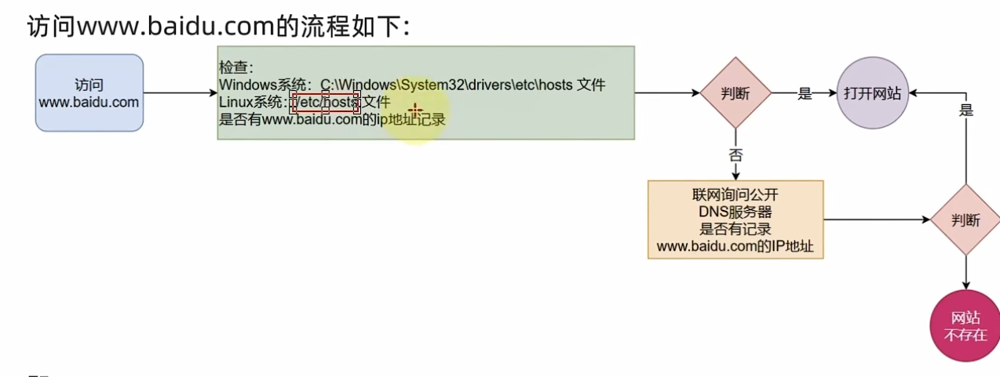
### 7. 网络请求和下载
#### 7.1 ping命令
1. 查看指定的==网络服务器==是否是可联通的状态，就是看能不能访问或者联网
2. 语法：
```
ping [ -c num ] ip或主机名
例：ping -c 3 baidu.com == ping 198.18.0.19
```
- 选项：-c 。检查的次数，不使用-c，则无限次持续检查
- 参数：ip或主机名，被检查的服务器ip或主机名地址
- 联通-->则显示的时间会很短，例如8ms
#### 7.2 wget命令
1. 非交互式的文件下载器，可以在命令行内下载网络文件，相当于将别人的网盘里的文件拷贝到自己的本地硬盘，而yum更像一个应用商店。
2. 语法：
```
wget [ -b ] url
例：
wget -b http://archive.apache.org/dis/hadoop/common/hadoop-3.3.0/hadoop-3.3.0.tar.gz
```
==可以通过tail命令监控后台下载进度：tail -f wget-log==
- 选项：-b 可选。后台下载，将下载日志写入到当前工作目录的wget-log文件
- 参数：url，下载链接
- ==注意：无论是否下载完成，都会生成要下载的文件==
#### 7.3 curl命令
1. 可以发送http网络请求，==相当于打开浏览器利用网址进行搜索==（只能得到html的源码，不能渲染），可用于：下载文件，获取信息
2. 语法：
```
curl [ -O（大写）] url
例：
curl -O http://archive.apache.org/dis/hadoop/common/hadoop-3.3.0/hadoop-3.3.0.tar.gz
```
- 选项：-O，用于下载文件，当==url是下载链接==时，可以使用此选项保存文件
- 参数：url，发起请求的网络地址
### 8. 端口
1. 设备与外界进行交流的==出入==口（有两个。发送端，接收端），分为物理端口（又称接口，如USB接口）和虚拟端口（计算机内部的端口，==是不可见的==，是用来==操作系统和外界==进行交互使用的）
2. 计算机程序之间的通信，==通过IP只能锁定计算机==，无法锁定计算机内的程序。==但通过端口可以锁定计算机上的具体程序。==IP相当于小区地址，而小区内住户的门牌号就相当于端口
3. IP+进程： a.b.c.d ：进程号
4. Linux中：
	- 公认端口：1-1023，通常被系统内置或者一些知名的程序预留使用，如SSH服务的22端口。非特殊需要不占用这个范围的端口。
	- 注册端口：1024-49151，通常随意使用==（用户自定义）==，用于松散的绑定一些程序\服务
	- 动态端口：49152-65535，通常不绑定固定的程序。而是当程序==对外进行网络连接时，用于临时使用（多用于出口）。==
#### 8.1 nmap命令
1. 查看==指定IP==对外的暴露端口
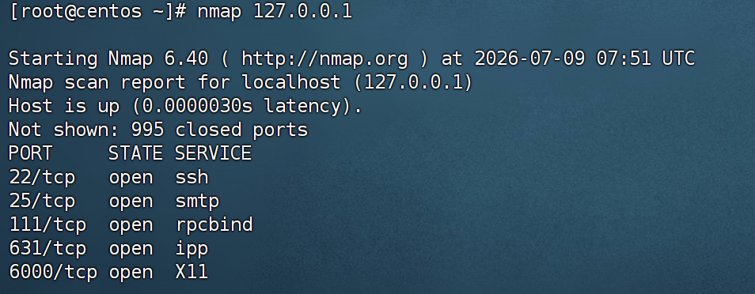
2. 语法：
```
nmap 被查看的IP地址
==>nmap 被查看的IP地址 | grep 查找的信息
```
#### 8.2 netstat命令
1. 查看==本机指定==端口占用情况
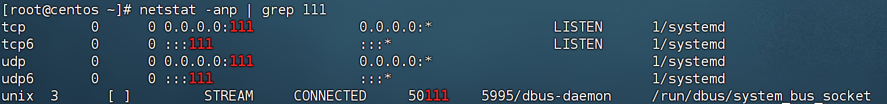
	可以看到111端口被程序（进程号）1占用了，其中0.0.0.0:111表示端口111被绑定在0.0.0.0这个IP上，表示允许被外界访问。
2. 语法：
```
netstat -anp |grep 查找的端口号或者进程
```
### 9. 进程管理
1. 进程是指程序在操作系统内**运行后**被注册为系统内的一个进程，==方便系统管理程序的运行。==并拥有独立的进程ID（进程号）
### 9.1 ps命令
1. 查看进程信息
2. 语法：
```
ps [ -e -f ]
ps [ -e -f ]|grep 指定进程
例：ps -ef|grep tail
```
- 选项：==-e 显示出全部进程，==-f 以完全格式化的形式展示全部信息 ^308w21
- ```ps -ef``` 列出全部进程的全部信息 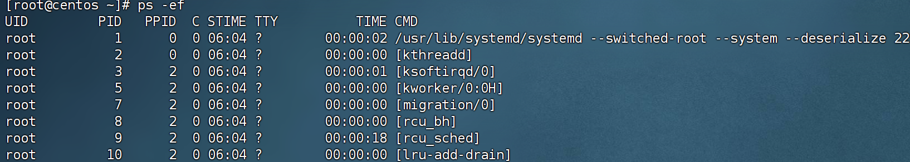
 - UID：进程所属用户id
 - ==PID：进程的进程号==
 - PPID：此进程的父id（启动此进程的其他进程）
 - C：进程的CPU占用率（百分比）
 - STIME：进程的启动时间
 - TTY：启动此进程的终端序号，如显示？，表示非终端启动
 - TIME：进程占用CPU时间（累计）
 - CMD：进程的启动命令或启动路径
#### 9.2 kill命令
1. 关闭进程
2. 语法
```
kill [ -9 ] 进程ID
```
- 选项：-9 ，可选，表示强制关闭进程。不使用此选项会向进程发送信号要求关闭，但是是否关闭要看进程本身的处理机制
### 10. 主机状态监测
#### 10.1 top命令
1. 类似于Windows的任务管理器，查看CPU、内存、进程的信息
2. 语法：直接输入```top```即可，其页面每5秒刷新一次，按q或Ctrl+c退出
3. 输出信息：
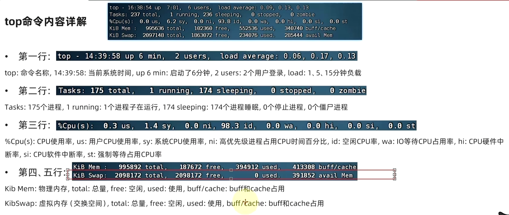

#### du命令
1. du: disk usage 磁盘占用情况统计。目录或文件所占磁盘空间大小的命令
2. 需要注意的是，使用"ls -r"命令是可以看到文件的大小的。但是大家会发现，==在使用"ls -r"命令査看目录大小时，目录的大小多数是 4KB，这是因为目录下的子目录名和子文件名是保存到父目录的 block（默认大小为 4KB）中的==，如果父目录下的子目录和子文件并不多，一个 block 就能放下，那么这个父目录就只占用了一个 block 大小。这时就需要使用 du 命令才能统计目录的真正磁盘占用量大小。
3. 语法：
```
[root@localhost ~]# du [ -a -h -s ] [目录或文件名]
例1.
[root@localhost ~]# du
#统计当前目录的总磁盘占用量大小，同时会统计当前目录下所有子目录的磁盘占用量大小，不统计子文件
#磁盘占用量的大小。默认单位为KB
20 ./.gnupg
#统计每个子目录的大小
24 ./yum.bak
8 ./dtest
28 ./sh
188
#统计当前目录总大小
例2.
[root@localhost ~]# du -ash
#统计当前目录的总大小，同时会统计当前目录下所有子文件和子目录磁盘占用量的大小。默认单位为 KB

4k ./.bashjogout
36k ./install.log
4k ./.bash_profile
4k ./.cshrc
…省略部分输出…
188k
188k
```
	 ==-a：显示每个子文件的磁盘占用量。默认只统计子目录的磁盘占用量==
	 ==-h：使用习惯单位显示磁盘占用量，如 KB、MB 或 GB 等；==
	 -s：统计总磁盘占用量，而不列出子目录和子文件的磁盘占用量


#### 10.2 df命令
1. df: disk free 空余磁盘。 查看磁盘的使用率 ^zp2kpd
2. 语法：
```
df [ -h -a ] 文件路径
```
- ==注意，使用 -a 选项，会将很多特殊的文件系统显示出来，这些文件系统包含的大多是系统数据，存在于内存中，不会占用硬盘空间，因此你会看到，它们所占据的硬盘总容量为 0。==
- 选项：-h，以更加人性化的单位显示
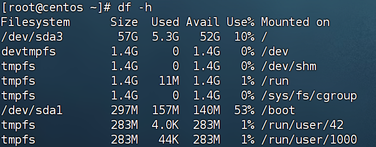
**du 命令是面向文件的，只会计算文件或目录占用的磁盘空间。也就是说，df 命令统计的分区更准确，是真正的空闲空间。**
#### free命令
==free -h==  查看内存使用（mem、swap）
查看==内存==（RAM）和==交换空间==（Swap）使用情况的最常用、最直接的命令是 free
free -h：
```text
              total        used        free      shared  buff/cache   available
Mem:           15Gi       4.2Gi       8.1Gi       300Mi       2.7Gi        10Gi
Swap:         2.0Gi          0B       2.0Gi
``` 

#### lsblk 查看设备挂载情况
1. lsblk命令的英文是“list block”，即用于列出所有可用==块设备==的信息，而且还能显示他们之间的依赖关系，但是它不会列出RAM盘的信息。
	- 在 Linux 系统中，设备文件主要分为两大类：块设备（Block Devices）和==字符设备==（Character Devices）。
	- 块设备：随机访问（可以直接跳到文件的任意位置读写）并且数据是以“块”单位（Block，通常为 512 字节或 4KB）为单位进行传输和缓存的。使用 ls -l 查看 /dev 目录，文件类型标识为 b。如硬盘（如 /dev/sda）、固态硬盘（SSD）、U盘、光驱等存储介质都属于块设备。
	- 字符设备：顺序访问（像流水一样，只能按顺序读写），以“字符/字节”为单位。使用 ls -l 查看 /dev 目录，文件类型标识为 c。如终端，串行口，打印机，键盘、鼠标，声卡
2. 语法：直接输入lsblk命令和lsblk -a输出相同
```
[root@test1 ~]# lsblk
NAME MAJ:MIN RM SIZE RO TYPE MOUNTPOINT
sda 8:0 0 40G 0 disk
├─sda1 8:1 0 300M 0 part /boot
├─sda2 8:2 0 2G 0 part [SWAP]
└─sda3 8:3 0 37.7G 0 part /
sr0 11:0 1 1024M 0 rom
```
- NAME：这是块设备名。
- MAJ:MIN：本栏显示主要和次要设备号。
- RM：本栏显示设备是否可移动设备。注意，在本例中设备
- sdb和sr0的RM值等于1，这说明他们是可移动设备。
- SIZE：本栏列出设备的容量大小信息。例如298.1G表明该设备大小为298.1GB，而1K表明该设备大小为1KB。
- RO：该项表明设备是否为只读。
- RO值为0，表明他们不是只读的。
- TYPE：本栏显示块设备是否是磁盘或磁盘上的一个分区。在本例中，==sda和sdb是磁盘，而sr0是只读存储（rom）==。
- MOUNTPOINT：本栏指出设备挂载的挂载点。
#### mount/umount 挂载/卸载
1. 对于Linux用户来讲，不论有几个分区，分别分给哪一个目录使用，==它总归就是一个根目录、一个独立且唯一的文件结构。== Linux中每个分区都是用来组成整个文件系统的一部分，它在==用一种叫做“挂载”的处理 方法，它整个文件系统中包含了一整套的文件和目录，并将一个分区和一个目录联系起来==， 要载入的那个分区将使它的存储空间在这个目录下获得。
2. mount 挂载:==所有的硬件设备必须挂载之后才能使用==，只不过，有些硬件设备（比如硬盘分区）在每次系统启动时会自动挂载
```bash
[root@localhost ~]# mount
#查看系统中已经挂载的文件系统，注意有虚拟文件系统
/dev/sda3 on / type ext4 (rw) <--含义是，将 /dev/sda3 分区挂载到了 / 目录上，文件系统是 ext4，具有读写权限
proc on /proc type proc (rw)
sysfe on /sys type sysfs (rw)
devpts on /dev/pts type devpts (rw, gid=5, mode=620)
tmpfs on /dev/shm type tmpfs (rw)
/dev/sda1 on /boot type ext4 (rw)
none on /proc/sys/fe/binfmt_misc type binfmt_misc (rw)
sunrpc on /var/lib/nfe/rpc_pipefs type rpc_pipefs (rw)
```
==/dev/sda3 **on** / **type ext4**  (rw) <--含义是，将 /dev/sda3 分区挂载到了 / 目录上，文件系统是 ext4，具有读写权限==
3. umount 卸载：卸载命令后面既可以加设备文件名，也可以加挂载点，不过只能二选一
```bash
[root@localhost ~]# cd /mnt/cdrom/
#进入光盘挂载点
[root@localhost cdrom]# umount /mnt/cdrom/
umount: /mnt/cdrom: device is busy.
#报错，设备正忙
```
正确语法：
```
[root@localhost ~]# umount /mnt/usb
#卸载U盘
[root@localhost ~]# umount /mnt/cdrom
#卸载光盘
[root@localhost ~]# umount /dev/sr0
#命令加设备文件名同样是可以卸载的
```
#### fdisk 命令
1. 如果新添加了一块硬盘，想要正常使用，需要对硬盘进行分区。
2. 语法：
```
[root@localhost ~]# fdisk ~l
#列出系统分区
[root@localhost ~]# fdisk 设备文件名
#给硬盘分区
```
#### 10.3 iostat命令
1. 查看磁盘速率等信息
2. 语法：
```
iostat [ -x ]  [ num1 ]  [ num2 ] 
```
- 选项：-x 显示更多信息
- num1：数字，刷新间隔，num2：数字，刷新几次。二者都不写，磁盘信息只显示一次。
```iostat -x```得到信息：
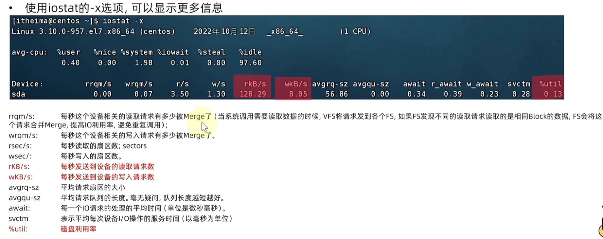
#### 10.4 sar -n DEV 命令
1. 查看网络情况
2. 语法：
```
sar -n DEV num1 num2
```
- 选项：-n（net） ,查看网络，DEV表示查看网络的接口
-  num1：数字，刷新间隔（不填就查看一次结束），num2：数字，刷新几次（不填就无限次）。
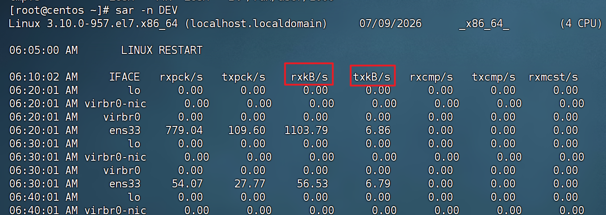
rxkB：网卡每秒读取了数据包的大小（kb）
txkB：网卡每秒发送了数据包的大小（kb）

### 11. 环境变量
1. 学习的一系列命令本质上是一个个可执行程序，例：cd命令本质是：/usr/bin/cd
2. 环境变量是一种keyvalue型结构，例如：PWD=/root。key是PWD，value是/root
#### 11.1 env命令
1. 查看环境变量 ^x4oocm
2. 语法：直接env即可
#### 11.2 PATH
**PATH=/usr/local/sbin:/usr/local/bin:/sbin:/bin:/usr/sbin:/usr/bin:/root/bin**
1.  之所以无论什么工作目录都能执行cd命令，是因为有PATH这个项目的值来做的。
2. PATH记录了系统执行任何命令的搜索路径：
	- /usr/local/sbin
	- /usr/local/bin
	- /sbin
	……
	当执行任何命令的时候，都会按照顺序，从上述路径中搜索要执行程序的本体
	比如执行cd命令时，就从第二个目录/usr/local/bin中搜索到cd命令
#### 11.3 $符号
1. 在Linux系统中,$被用于取==环境变量中==变量（key）的值（value）。例如:
```
echo $cd
无输出
echo $PATH
输出：PATH=/usr/local/sbin:/usr/local/bin:/sbin:/bin:/usr/sbin:/usr/bin:/root/bin
```
2. 在环境变量中变量（key）的值（value）后进行拼接-->当和其他内容混合在一起时，用{}来标注变量是什么（以PATH为例）
```
echo ${PATH}/abc
输出：PATH=/usr/local/sbin:/usr/local/bin:/sbin:/bin:/usr/sbin:/usr/bin:/root/bin/abc
```
#### 11.4 自行设置环境变量
1. 临时设置，语法：```export 变量名=变量值 ```
2. 永久设置： ^4d8ptq
	- 只针对**当前用户**生效，配置在当前用户的：==~==/==.==bashrc 文件中
	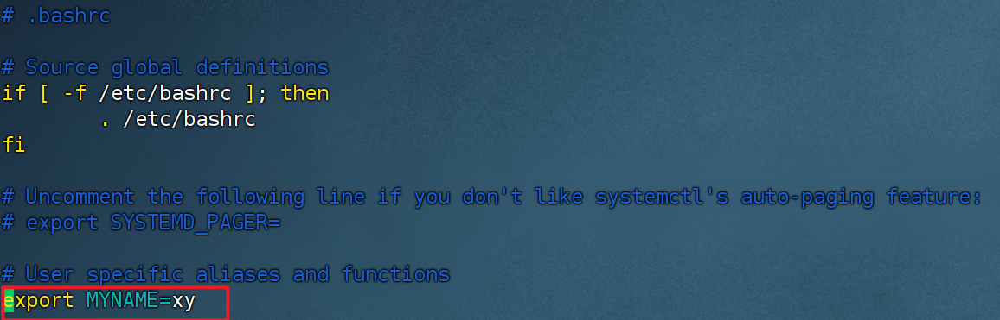
	```[xy@centos ~]$ source ~/.bashrc```
	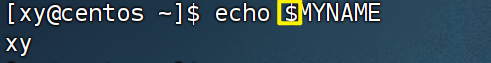  ^g9e65n
	- 针对**所有用户**生效，配置在系统的：/etc/profile 文件中==(需要root权限）==。 ^xqlvhn
	- 最后两者生效需要：通过语法：source 配置文件（/etc/profile或~/.bashrc ），立即生效。或重新进入finalshell
3. 自定义环境变量PATH：
```
	[root@centos ~]# mkdir myenv
	[root@centos ~]# ls
	anaconda-ks.cfg  myenv  original-ks.cfg
	[root@centos ~]# cd m*
	[root@centos myenv]# ls
	mkha
	[root@centos myenv]# vim mkha
	echo "哈哈哈哈"
	[root@centos myenv]# ls -lah
	total 16K
	drwxr-xr-x. 2 root root  35 Jul 10 03:37 .
	dr-xr-x---. 6 root root 248 Jul 10 03:37 ..
	-rw-r--r--. 1 root root  19 Jul 10 03:37 mkha
	-rw-r--r--. 1 root root 12K Jul 10 03:33 .mkha.swp
	[root@centos myenv]# chmod 755 mkha
	[root@centos myenv]# ls -lah
	total 16K
	drwxr-xr-x. 2 root root  35 Jul 10 03:37 .
	dr-xr-x---. 6 root root 248 Jul 10 03:37 ..
	-rwxr-xr-x. 1 root root  19 Jul 10 03:37 mkha
	-rw-r--r--. 1 root root 12K Jul 10 03:33 .mkha.swp
	[root@centos myenv]# ./mkha
	哈哈哈哈
	[root@centos myenv]# vim /etc/profile!
```
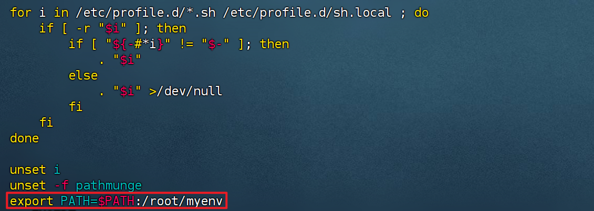
```
	[root@centos myenv]# source /etc/profile
	[root@centos myenv]# echo $PATH
	/usr/local/sbin:/usr/local/bin:/sbin:/bin:/usr/sbin:/usr/bin:/root/bin:/root/myenv
	[root@centos myenv]# mkha
	哈哈哈哈
```

### 12. Linux文件上传和下载
1. 拖拽：
	- Linux-->Windows后找到fsdownload就行
	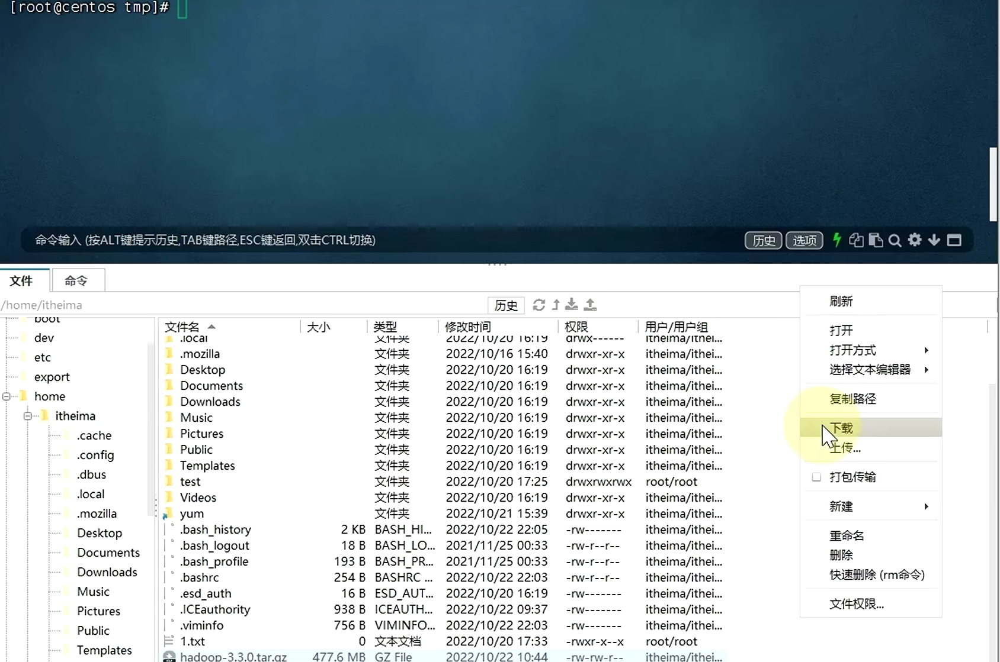
	-  在finalshell中登录root用户（在finalshell设置页面输入root及密码就行）
	-  Windows-->Linux直接拖到相应的目录即可
2. rz和sz命令：
	- rz：上传（windows-->Linux)，语法：直接rz在弹窗中找到要上传的文件
	- sz：下载（Linux-->windows)，语法：sz 要传给Windows的文件

### 13. 压缩和解压
1. 格式：zip，tar，gzip
2. .tar文件(归档文件）：将文件简单的组装到.tar文件中。文件体积大小并没有太多减少。
3. .gz文件（gzip压缩文件）：后缀为.tar.gz或.gz。会大大减少文件体积
#### 13.1 tar 命令压缩
1. 语法：
```
tar -cvf 文件1.tar 文件2 文件3……
tar -zcvf 文件1.tar.gz 文件2 文件3……
```
2. 两个语法都是将文件2与文件3压缩到文件1中，只是第二种运用gzip模式压缩。
3. 选项：-c 创建压缩文件，用于压缩模式。-v 显示压缩，解压过程。用于查看进度。-f 要创建的文件或要解压的文件，并且-f选项要处于最后一个。-z 启用gzip模式，用该选项时要处于第一个。
#### 13.2 tar命令解压
1. 语法：
```
tar -xvf 文件1.tar -C 指定路径
tar -zxvf 文件1.tar.gz -C 指定路径
```
2. 两个语法都是将文件2与文件3解压到文件1中，只是第二种运用gzip模式解压。
3. 选项： -x 解压模式。 -C 单独使用，和解压所需要的其他参数分开
#### 13.3 zip命令压缩
1. 语法：
```
zip [ -r ] 参数1.zip 参数2 ……参数n
例：zip -r test.zip test test.txt
```
2. 选项：-r 被压缩的目标文件中包含文件夹的时候，需要用-r选项。与rm、cp等命令效果一致
#### 13.4 unzip命令解压zip文件
1. 语法：
```
unzip [ -d ] 参数
例：unzip test.zip -d /home/xy
```
2. 选项：-d 指定要解压去的位置，同tar命令的-C选项
3. 参数，要被解压的zip压缩包文件
- 解压时，有同名的文件时，解压出来的文件会覆盖原文件
## 第五章 shell
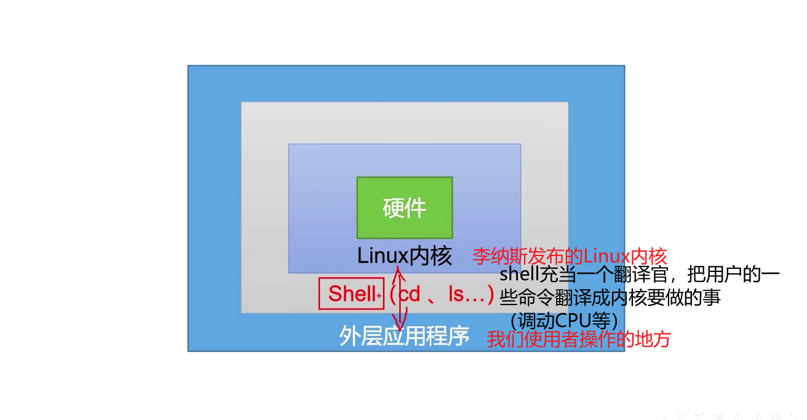
1. shell是一个命令行的解释器。shell 还是一个==功能强大的编程语言==，易用于编写易调试（脚本）
2. shell的实现方式有很多，Linux提供的shell**解析器bash**
```
[root@centos ~]# cat /etc/shells
/bin/sh
/bin/bash
/usr/bin/sh #sh默认指向bash
/usr/bin/bash
/bin/tcsh
/bin/csh
```
### 1. shell脚本
1. shell脚本的一般后缀是 .sh。其实如果内容是按照 shell 标准去写的，后缀名不是这个也没有关系.
2. 脚本的格式:脚本以 ==#!/bin/ bash ==开头(指定解析器)
```
[root@centos ~]# mkdir scripts
[root@centos ~]# cd
[root@centos ~]# cd sc*
[root@centos scripts]# pwd
/root/scripts
[root@centos scripts]# touch hello.sh
[root@centos scripts]# ls
hello.sh
[root@centos scripts]# vim hello.sh

#!/bin/bash
echo "hello,world"
echo "我想你了"
-----------------------------------------------------------------------------------
执行脚本的第一种用法
[root@centos scripts]# bash hello.sh
hello,world
我想你了
[root@centos scripts]# bash h*
hello,world
我想你了
[root@centos scripts]# cd ~
[root@centos ~]# bash scripts/hello.sh 
hello,world
我想你了
[root@centos ~]# cd scripts/
[root@centos scripts]# sh hello.sh 
hello,world
我想你了
-----------------------------------------------------------------------------------
执行脚本的第二种方法:
[root@centos scripts]# ./hello.sh
-bash: ./hello.sh: Permission denied
[root@centos scripts]# ll
total 4
-rw-r--r--. 1 root root 51 Jul 13 03:00 hello.sh
[root@centos scripts]# chmod +x hello.sh 
[root@centos scripts]# ll
total 4
-rwxr-xr-x. 1 root root 51 Jul 13 03:00 hello.sh
[root@centos scripts]# hello.sh
bash: hello.sh: command not found...
[root@centos scripts]# cd hello.sh
-bash: cd: hello.sh: Not a directory
[root@centos scripts]# ./hello.sh 
hello,world
我想你了
-----------------------------------------------------------------------------------
执行脚本的第三种方法
[root@centos scripts]# source hello.sh 
hello,world
我想你了
[root@centos scripts]# . hello.sh 
hello,world
我想你了

```
3. 执行:
	第一种方法:
	- bsah 加上路径
	-  ==sh 加上路径==
	==第二种方法:==
		直接输入脚本的绝对路径或者相对路径执行脚本
		注意的问题：
			1. -bash: ./hello.sh: Permission denied这个是没有 x 权限，解决办法chmod +x hello.sh 
			2. `[root@centos scripts]# hello.sh 
			`  bash: hello.sh: command not found...`
			解决办法:./hello.sh (是因为如果直接输入 hello.sh，那么它只能认为这是一个命令，但是它环境路径下找不到这个命令。)
			
	第三种方法：
		运用source方法或者加一个点一个空格的方法。注意：`./ `不等于`.空格 `
**第一、二种方法是开了一个子进程(就是在当前的进程中再开一个子进程)，但是第三种方法是直接调用了那个父进程（shell）**，解释如下：
		
	中间的圆圈相当于 bash，里面的方框相当于 root，外面的方框相当于创建的用户。
```
[root@centos scripts]# ps -f
UID         PID   PPID  C STIME TTY          TIME CMD
root      28667  41671  0 04:54 pts/0    00:00:00 ps -f
root      41578  17139  0 03:47 pts/0    00:00:00 su - root
root      41671  41578  0 03:47 pts/0    00:00:00 -bash
[root@centos scripts]# bash
[root@centos scripts]# ps -f
UID         PID   PPID  C STIME TTY          TIME CMD
root      30461  41671  0 04:55 pts/0    00:00:00 bash
root      30673  30461  0 04:55 pts/0    00:00:00 ps -f
root      41578  17139  0 03:47 pts/0    00:00:00 su - root
root      41671  41578  0 03:47 pts/0    00:00:00 -bash
[root@centos scripts]# exit
exit
[root@centos scripts]# ps -f
UID         PID   PPID  C STIME TTY          TIME CMD
root      31297  41671  0 04:56 pts/0    00:00:00 ps -f
root      41578  17139  0 03:47 pts/0    00:00:00 su - root
root      41671  41578  0 03:47 pts/0    00:00:00 -bash
```
在子进程 shell 中设置的环境变量无法同步到父进程；在父进程中设置的环境变量若在子进程中被修改，父进程也不会体现该修改。

### 2. 普通变量
1. 一种划分方式是可以分为两部分： 系统定义的变量、用户定义的变量
2. 另一种划分方式是可以分为两部分： 全局变量[环境变量](Linux学习/Linux.md#^x4oocm)、局部变量
3. 两种划分方式是彼此有交叉的环境变量
4. 用户定义变量示例：a=2  ==等于号的左右不能有空格==  局部变量
```
[root@centos scripts]# a=2
[root@centos scripts]# echo $a
2
```
5. 用户定义全局变量示例  [export](Linux学习/Linux.md#^4d8ptq)
```
[root@centos scripts]# bash
[root@centos scripts]# echo $a

[root@centos scripts]# exit
exit
[root@centos scripts]# export a
[root@centos scripts]# bash
[root@centos scripts]# ps -f
UID         PID   PPID  C STIME TTY          TIME CMD
root      41578  17139  0 03:47 pts/0    00:00:00 su - root
root      41671  41578  0 03:47 pts/0    00:00:00 -bash
root      84427  41671  0 05:26 pts/0    00:00:00 bash
root      84633  84427  0 05:26 pts/0    00:00:00 ps -f
[root@centos scripts]# echo $a
2
```
但是如果在子进程中把变量进行了修改，在父进程中变量原有的值是不会改变的。
即使在子进程中使用 export 命令，==父进程中不会显示改变后的值。==
示例：
```
[root@centos scripts]# echo $a
2
[root@centos scripts]# a=3
[root@centos scripts]# echo $a
3
[root@centos scripts]# exit
exit
[root@centos scripts]# echo $a
2
[root@centos scripts]# bash
[root@centos scripts]# export a
[root@centos scripts]# echo $a
2              #这里也可以看到，退出一个 bash，然后再进入一个 bash，这两个 bash 是不一样的。
[root@centos scripts]# a=3
[root@centos scripts]# export a
[root@centos scripts]# exit
exit
[root@centos scripts]# echo $a
2
```
在脚本中是这样体现的:
```
[root@centos scripts]# a=3
[root@centos scripts]# export a
[root@centos scripts]# exit
exit
[root@centos scripts]# echo $a
2
[root@centos scripts]# vim hello.sh 
-----------------------------------------------------------------------------------
#!/bin/bash
echo "hello,world"
echo "我想你了"
echo $a
-----------------------------------------------------------------------------------
[root@centos scripts]# b=4
[root@centos scripts]# vim hello.sh
-----------------------------------------------------------------------------------
#!/bin/bash
echo "hello,world"
echo "我想你了"
echo $a
echo $b
---------------------------------------------------------------------------------- 
[root@centos scripts]# ./hello.sh 
hello,world
我想你了
2

-----------------------------------------------------------------------------------
[root@centos scripts]# . hello.sh 
hello,world
我想你了
2
4
```
类型:另外变量定义的时候都是字符串:
```
[root@centos scripts]# a=1+5
[root@centos scripts]# echo $a
1+5
```
定义只读变量**readonly**:
```
[root@centos scripts]# readonly c=9
[root@centos scripts]# c=1
-bash: c: readonly variable
```
将定义的变量撤销:
先==set==一下看一下所有的变量：`[root@centos scripts]# set | less`
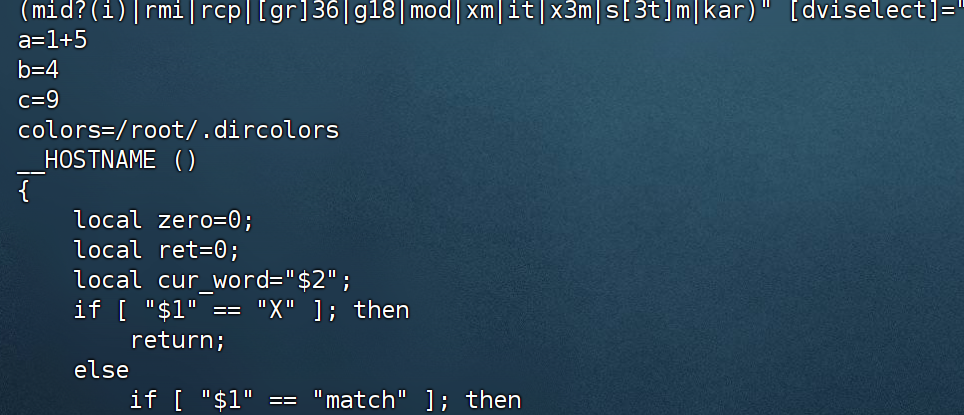
```
[root@centos scripts]# unset a
[root@centos scripts]# unset c
-bash: unset: c: cannot unset: readonly variable
```
只读变量不能用 **unset** 去撤销
### 3. 特殊变量（想要带 $ 的特殊变量在 echo 中==原本==输出，那么 echo 后面用单引号。）
#### 3.1. $n
举例理解:相当于一个占位符，当是两位数字时，${10}
```
[root@centos scripts]# vim hello.sh 

#!/bin/bash
echo "hello,world"
echo "hello,$1"

[root@centos scripts]# . hello.sh 
hello,world
hello,

[root@centos scripts]# . hello.sh 'xiao ming'
hello,world
hello,xiao ming

```
测试$0:(执行脚本的位置)
```
[root@centos scripts]# vim hello.sh 

#!/bin/bash
echo "hello,world"
echo "hello,$1"
echo "name: $0"

[root@centos scripts]# ./hello.sh 
hello,world
hello,
name: ./hello.sh

[root@centos scripts]# . hello.sh 
hello,world
hello,
name: -bash
```
#### 3.2 $\#(统计自己给定参数的个数)
```
[root@centos scripts]# vim hello.sh 
#!/bin/bash
echo "hello,world"
echo "hello,$1"
echo "name: $0"
echo "num: $#"

[root@centos scripts]# ./hello.sh 
hello,world
hello,
name: ./hello.sh
num: 0
[root@centos scripts]# ./hello.sh abc
hello,world
hello,abc
name: ./hello.sh
num: 1
```
#### 3.3 \$\*、\$@(都是代表命令行中的所有参数)
区别在于：前者是把所有参数看成一个整体，后者==$@==是把每个参数区分对待。
```
[root@centos scripts]# vim hello.sh 
#!/bin/bash
echo "hello,world"
echo "hello,$1"
echo "name: $0"
echo "num: $#"
echo '$*'
echo $*
echo '$@'
echo $@

[root@centos scripts]# ./hello.sh 
hello,world
hello,
name: ./hello.sh
num: 0
$*

$@

[root@centos scripts]# ./hello.sh abc
hello,world
hello,abc
name: ./hello.sh
num: 1
$*
abc
$@
abc

```
#### 3.4 $?
执行完命令之后，返回执行后的状态。返回0，则没有报错。返回其他值，则说明报错
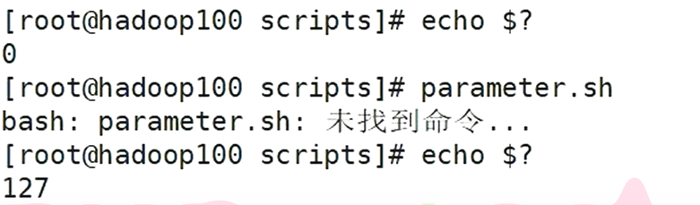
### 4. 运算符
就是在命令行中进行四则运算。
expr命令
```
[root@centos scripts]# expr 2 + 3
5
[root@centos scripts]# expr 2 * 3
expr: syntax error
[root@centos scripts]# expr 2 \* 3
6
```
==为了简便：\$((运算式))或\$\[运算式\]==
```
[root@centos scripts]# echo $[2*3]
6
[root@centos scripts]# a=$[2*3]
[root@centos scripts]# echo a
6
```
### 5. 条件判断
- test命令
- \[ ] 注意里面有好多空格  \[ 1$a2 =3 Hello4 ]  4个空格
- ==$? 需要有echo==
```
[xy@centos ~]$ a=hello
[xy@centos ~]$ echo $a
hello
[xy@centos ~]$ test $a = hello
[xy@centos ~]$ $?                   # $? 需要有echo
bash: 0: 未找到命令...               #$?不是一个命令
[xy@centos ~]$ echo $?
127  #可以理解为 127 的错误
[xy@centos ~]$ test $a = hello
[xy@centos ~]$ echo $?
0   #可以理解为 0 个错误
[xy@centos ~]$ test $a != hello
[xy@centos ~]$ echo $?
1   #可以理解为一个错误
[xy@centos ~]$ [$a = hello]        #[]的空格
bash: [hello: 未找到命令...
[xy@centos ~]$ [ $a = hello ]
[xy@centos ~]$ echo $?
0
[xy@centos ~]$ [ $a = Hello ]
[xy@centos ~]$ echo $?
1
[xy@centos ~]$ [ $a != Hello ]
[xy@centos ~]$ echo $?
0
```
**5.1 数值比较:**
```
[xy@centos ~]$ [ 2 = 2 ]
[xy@centos ~]$ echo $?
0
[xy@centos ~]$ [ 2 = 3 ]
[xy@centos ~]$ echo $?
1
[xy@centos ~]$ [ 2 < 3 ]
-bash: 3: 没有那个文件或目录
```
- 所以大于、小于、等于有专门的方法。示例中的等于是把左右两边的数字看成了字符串。真正的数值比较是要用以下的方法
	等于（equal)：-eq
	不等于(not equal)：-ne
	小于(less than)：-lt
	小于等于(less equal)：-le
	大于(greater than)：-gt
	大于等于(greater equal)：-ge
	
```
[xy@centos ~]$ [ 2 lt 3 ]
-bash: [: lt: 期待二元表达式
[xy@centos ~]$ [ 2 -lt 3 ]
[xy@centos ~]$ echo $?
0
```
除了对于数值的判断，
**5.2  还能对文件权限进行判断**
==只要有一个 W X R，那么它返回的就是 0==
```
[root@centos ~]# mkdir test
[root@centos ~]# ll
total 8
-rw-------. 1 root root 2791 Jul  3 16:19 anaconda-ks.cfg
drwxr-xr-x. 2 root root   35 Jul 10 03:42 myenv
-rw-------. 1 root root 2071 Jul  3 16:19 original-ks.cfg
drwxr-xr-x. 2 root root   22 Jul 14 03:34 scripts
drwxr-xr-x. 2 root root    6 Jul 14 03:35 test
[root@centos ~]# chmod 674 test
[root@centos ~]# ll
total 8
-rw-------. 1 root root 2791 Jul  3 16:19 anaconda-ks.cfg
drwxr-xr-x. 2 root root   35 Jul 10 03:42 myenv
-rw-------. 1 root root 2071 Jul  3 16:19 original-ks.cfg
drwxr-xr-x. 2 root root   22 Jul 14 03:34 scripts
drw-rwxr--. 2 root root    6 Jul 14 03:35 test
[root@centos ~]# [ -x test ]
[root@centos ~]# echo $?
0            # 目录的所有者（root）没有 `x` 权限，但 `[ -x test ]` 却返回 0。我解释了这是                因为 root 用户的特权
```
**5.3 判断文件的类型**
- 是一个是否存在的文件，还是一个常规的文件，还是一个目录。
	判断文件是否存在用 -e，
	判断是否是一个常规文件用 -f，
	判断是否是一个目录用 -d。
```
[root@centos ~]# ll
total 8
-rw-------. 1 root root 2791 Jul  3 16:19 anaconda-ks.cfg
drwxr-xr-x. 2 root root   35 Jul 10 03:42 myenv
-rw-------. 1 root root 2071 Jul  3 16:19 original-ks.cfg
drwxr-xr-x. 2 root root   22 Jul 14 03:34 scripts
drw-rw-rw-. 2 root root    6 Jul 14 03:35 test
[root@centos ~]# [ -e test ]
[root@centos ~]# echo $?
0
[root@centos ~]# [ -f test ]
[root@centos ~]# echo $?
1
[root@centos ~]# [ -d test ]
[root@centos ~]# echo $?
0
```
**5.4 多种条件的组合判断：**
- 逻辑与&&,还有另一个作用:上一条命令执行成功之后，再执行下一条命令
- 逻辑或||,还有另一个作用:上一条命令执行失败之后，再去执行下一条命令
```
[root@centos ~]# [ a -lt 20 ] && echo "a<20" || echo "a>=20"
-bash: [: a: integer expression expected
a>=20
报错原因	a 是字符串，不能用于 -lt 整数比较

[root@centos ~]# [ $a -lt 20 ] && echo "$a<20" || echo "$a>=20"
15<20
```
\[  ]里面只要有东西，那么就是真。里面是空的，那么就是假。
```
[root@centos ~]# [ cjsak ] && echo "方括号里面的是真" || echo "方括号里面的是假"
方括号里面的是真
[root@centos ~]# [ ] && echo "方括号里面的是真" || echo "方括号里面的是假"
方括号里面的是假
```
### 6. 条件判断后的分支流程，if 判断
```
[root@centos scripts]# vim if_test.sh
#!/bin/bash

if [ $1 = xy ]
then
        echo "welcomeback" 
fi
[root@centos scripts]# chmod +x if_test.sh 
[root@centos scripts]# ./if_test.sh a
[root@centos scripts]# . if_test.sh 
-bash: [: =: unary operator expected
[root@centos scripts]# . if_test.sh xy
welcomeback
-----------------------------------------------------------------------------------
不输入参数也不报错:
[root@centos scripts]# vim if_test.sh
#!/bin/bash

if [ "$1"x = "xy"x ]
then 
        echo "welcomeback" 
fi

[root@centos scripts]# . if_test.sh 
[root@centos scripts]# ./if_test.sh 
[root@centos scripts]# ./if_test.sh xy
welcomeback
```
If后面有多个条件判断:
在then的前面会有一个分号。然后在 fi 前面有一个分号
```
[root@centos scripts]# a=25
[root@centos scripts]# if [ $a -gt 18 ] && [ $a -lt 35 ];then echo "ok"
> fi
ok
[root@centos scripts]# if [ $a -gt 18 ] && [ $a -lt 35 ];then echo "ok"; fi
ok
[root@centos scripts]# a=15
[root@centos scripts]# if [ $a -gt 18 ] && [ $a -lt 35 ];then echo "ok"; fi
```
两个条件放一起 -a :
```
[root@centos scripts]# if [ $a -gt 18 -a $a -lt 35 ];then echo "ok" fi
> ^C
[root@centos scripts]# if [ $a -gt 18 -a $a -lt 35 ];then echo "ok" ;fi
[root@centos scripts]# a=25
[root@centos scripts]# if [ $a -gt 18 -a $a -lt 35 ];then echo "ok" ;fi
ok
```
**6.1 If else语句**
```
[root@centos scripts]# vim if_test.sh
-----------------------------------------------------------------------------------
#!/bin/bash

if [ "$1"x = "xy"x ]
then
        echo "welcomeback" 
fi
-----------------------------------------------------------------------------------
if [ $2 -lt 18 ]
then
        echo "weichengnian"
elif [ $2 -lt 40 ]
then
        echo "zhongnian"
elif [ $2 -lt 60 ]
then
        echo "zhonglaonian"
else
        echo "laonian"
fi
-----------------------------------------------------------------------------------
[root@centos scripts]# ./if_test.sh xy 46
welcomeback
zhonglaonian
```
**6.2 case的多分支结构**
```
[root@centos scripts]# vim case.sh
#!/bin/bash

case $1 in
1)
        echo "one"
;;
2)
        echo "two"
;;
3)
        echo "three"
;;
*)
        echo "other num"
;;
esac

[root@centos scripts]# chmod +x case.sh 
[root@centos scripts]# ./case.sh 2
two
[root@centos scripts]# ./case.sh 3
three
[root@centos scripts]# ./case.sh 4
other num
```
### 7. for循环
```
[root@centos scripts]# vim sum.sh
#!/bin/bash

for (( i=1; i <=  $1 ;i++)) # (( )) 是 C 风格算术表达式，应该用 <=，而不是 -le。
do
        sum=$[ $sum+$i ]
done
echo $sum

[root@centos scripts]# ./sum.sh 100
5050
```
- 可以作为遍历。{1..100}表示从1到100，
- 容易犯错误的点：in后面可以跟一个集合；在do的前面和done的前面都会有一个分号(分步执行），然后echo后面会有一个$符号
```
[root@centos scripts]# for i in a b c;do echo $i;done
a
b
c
[root@centos scripts]# for i in {1..100};do sum=$[$sum+$i] ;done;echo $sum
5050
```
再一次说明 \$* 和 \$@。==$@==会把变量拆成一个一个的（想要带 $ 的特殊变量在 echo 中原本输出，那么 echo 后面用单引号。）
```
[root@centos scripts]# vim $*_$@test
#!/bin/bash

echo '------$*------'
for i in $*
do
        echo $i
done

echo '------$@------'
for i in $@
do
        echo $i
done

echo '-----"$*"------'
for i in "$*"
do
        echo $i
done

echo '------"$@"------'
for i in "$@"
do
        echo $i
done

[root@centos scripts]# chmod +x $*_$@test
[root@centos scripts]# ll
total 20
-rwxr-xr-x. 1 root root 109 Jul 14 06:05 case.sh
-rwxr-xr-x. 1 root root 114 Jul 13 08:18 hello.sh
-rwxr-xr-x. 1 root root 219 Jul 14 05:52 if_test.sh
-rwxr-xr-x. 1 root root  78 Jul 14 07:53 sum.sh
-rwxr-xr-x. 1 root root 227 Jul 14 08:25 _test
[root@centos scripts]# ./_test a b c d
------$*------
a
b
c
d
------$@------
a
b
c
d
-----"$*"------
a b c d
------"$@"------
a
b
c
d
```
### 8. while循环
(())与\[ ] 
for 与 while
```
[root@centos scripts]# vim sum.sh
#!/bin/bash

for (( i=1; i <=  $1 ;i++))
do
        sum=$[ $sum+$i ]
done
echo $sum

a=1
while (($a<=$1))
do
        sum1=$(($sum1+$a))
        a=$(($a+1))
done
echo $sum1

[root@centos scripts]# ./sum.sh 100
5050
5050
```
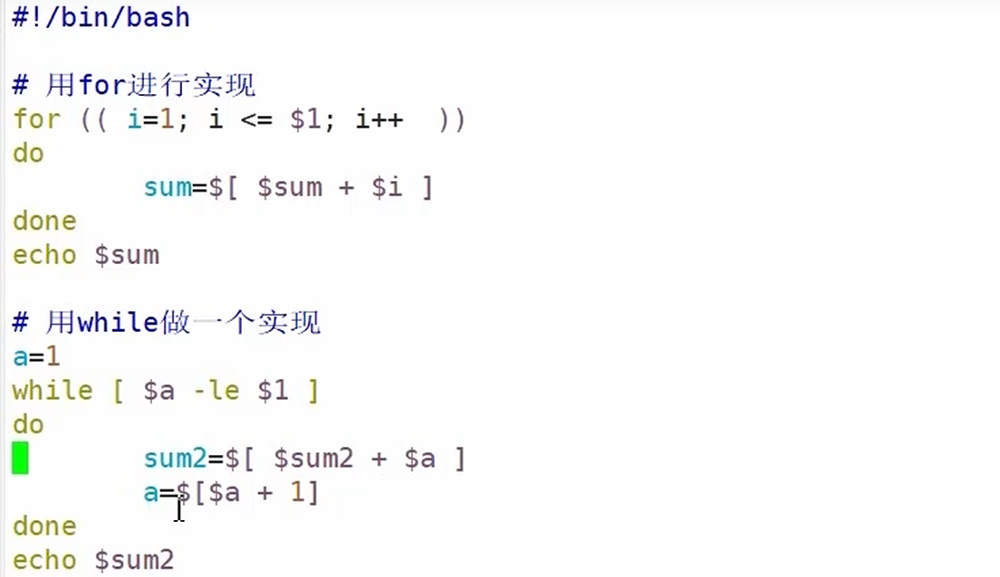

**8.1 let**变成c语言的写法
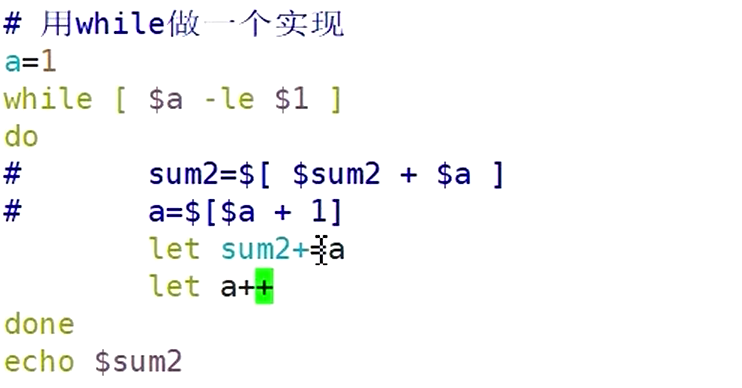
### 9. 用户的输入
read命令
语法：
```
read [ -p -t ] 参数
```
1. 选项:
	-p:指定读取时的提示语
	-t：指定读取时的等待时间，单位是秒。如果不输入这个选项，那么就一直等待，直到用户输入。
2. 参数：
	变量：指定读取值的变量名

```
[root@centos scripts]# vim read.sh

#!/bin/bash
read -t 10 -p "请输入你的名字" name
echo "$name,hello"

[root@centos scripts]# . read.sh 
请输入你的名字xy
xy,hello
```
### 10. 系统函数（在脚本中调用格式 $() )
主要有一个练习和basename、dirname两个命令
basenam、dirname实际上是剪切函数

对于basename：
减去最后一个斜杆前的的所有内容，最后添的参数是减去末尾的字母
```
path:/root/scripts/practice.sh
[root@centos scripts]# basename practice.sh sh
practice.
```
而dirname相反，保留最后一个斜杆前的的所有内容

在一个命令中调用另一个命令，需要用$( )，命令替换。
对于命令替换（命令中用命令）：
```
a=$(expr 2 + 3)
```

```
[root@centos scripts]# vim practice.sh

#!/bin/bash
echo '=====$n===='
echo "脚本名称:$(basename $0 .sh)"
cd $(dirname $0)
echo "path:$(pwd)"
echo "1st paramater:$1"
echo "2nd paramater:$2"
echo '====$#===='
echo "paramater num:$#"
echo '====$*===='
echo "$*"
echo '====$@===='
echo "$@"

[root@centos scripts]# chmod +x practice.sh 
[root@centos scripts]# ./practice.sh a b
=====$n====
脚本名称:practice
path:/root/scripts
1st paramater:a
2nd paramater:b
====$#====
paramater num:2
====$*====
a b
====$@====
a b
```
### 11. 自定义函数
```
[root@centos scripts]# vim function_test

#!/bin/bash

function add()
{
        s=$[$1 + $2]
        echo $s
}

read -p"a= " a
read -p"b= " b

add $a $b

sum=$(add $a $b)
echo "pingfang_$[sum * sum]"

[root@centos scripts]# ./function_test 
a= 190
b= 200
390
pingfang_152100
```
function add()  不用传形参
sum=$(add $a $b)  相当于把函数的返回值赋给 sum
## 第六章 C语言编程
### 1. GCC
1. 作用：编译器工具集，支持多种编程语言，将源代码编译成机器语言，生成可执行文件或库文件（编译成二进制文件）。
2. gcc语法：
**一步到位：** **编译**分"编译→链接"两步。
```bash
gcc main.c hello.c -o main
```
- -o：output的缩写，表示输出，用于指定输出文件名，上面一段命令是指用main.c hello.c两个文件生成一个可执行的main文件

**预处理：**
```bash
gcc -E hello.c -o hello.i
gcc -E main.c -o main.i
```
- -E：Expand（展开）的缩写，该参数指定gcc执行预处理操作。
- i：intermediate（中间的）的缩写，预处理后的源文件通常以.i作为后缀。
**编译：**
```bash
gcc -S hello.i -o hello.s
gcc -S main.i -o main.s
```
- -S：Source（源代码）的缩写，该参数指定gcc将预处理后的源码编译为汇编语言。
- .s：Assembly Source（汇编源码）的缩写，通常编译后的汇编文件以.s作为后缀。
==**汇编： 只编译不链接==
```bash
gcc -c main.s -o main.o
gcc -c hello.s -o hello.o
```
- -c：可以被理解为Compile or Assemble（编译或汇编），该参数可以指定gcc将汇编代码翻译为机器码，但不做链接。此外，该参数也可以用于将.c文件直接处理为机器码，同样不做链接。
- -o：Object的缩写，通常汇编得到的机器码文件以.o为后缀。
**链接：**
	**静态链接：**
```bash
	gcc -static main.o hello.o -o main
```
- -static：该参数指示编译器进行静态链接，而不是默认的动态链接。使用这个参数，GCC会尝试将所有用到的库函数直接链接到最终生成的可执行文件中，包括C标准库（libc）、数学库（libm）和其他任何通过代码引用的外部库。
	**动态链接：**
```bash
	gcc main.o hello.o -o main
```
- gcc默认执行动态链接，即==glibc库文件没有包含==到可执行文件中。

| 选项       | 作用                     |
| -------- | ---------------------- |
| ==`-g`== | ==产生**调试信息**（供 GDB）==  |
| ==`-o`== | ==指定**输出文件名**==        |
| ==`-c`== | ==**只编译不链接**，生成 `.o`== |
| ==`-L`== | ==指定**库搜索路径**==        |
| ==`-w`== | ==**关闭所有警告**==         |
```bash
都是一步到位，生成可以执行文件
gcc hello.c -L/home/user/libs -lmylib -o main
gcc -w hello.c -o main
```
### 2. glibc
1. 作用：将两个系统（Windows和Linux）中相同的库函数（如stdio.h\stdlib.h），虽然底层的执行程序有所不同，但是它们的表示是相同的，最后达到的作用也是相同的。主要因为依赖于这个项目。程序中使用的标准库函数（如printf或malloc）是通过glibc提供的。
### 3. GNU C
1. 说明： C语言编程标准
**总的来说，GCC是编译器，负责将源代码转换为可执行代码；glibc是运行时库，提供程序运行所需的标准函数和操作系统服务的接口；而GNU C则定义了GCC支持的C语言的标准和扩展。**
### 4.GDB
1. 作用：Linux下的纯命令行程序调试器（找Bug神器）。它能让代码“慢动作回放”，通过设置暂停关卡（断点）、单步执行、实时查看变量值前提：==用GCC编译时必须加 `-g` 参数带上调试信息，否则GDB无法工作==
```bash
	gcc -g hello.c -o bug_debug
	gdb ./bug_debug
```
1. gdb语法：
**启动调试：**
```bash
gdb main
```
- gdb：启动调试器的命令。
- main：你要调试的那个**可执行**文件的名字。这条命令的意思是：把 `main` 程序加载到GDB下进入 `(gdb)` 提示符的交互界面。
**核心调试连招（进入 `(gdb)` 提示符后使用）：**
```gdb
(gdb) break 15
(gdb) run
(gdb) print count
(gdb) next
```
- **break (简写 b)**：设置断点。`break 15` 的意思是：在代码的第15行设一个关卡，程序跑到这里就会自动停住。
- **run (简写 r)**：开始运行程序，直到撞到你刚才设的第15行断点才停下来。
- **print (简写 p)**：查看当前变量的值。`print count` 的意思是：程序暂停在第15行时，帮我看看内存里 `count` 这个**变量**现在的值是多少，看看对不对。
- **next (简写 n)**：执行下一步。让代码只往下走一行，**然后再次停住**，方便你观察代码一行一行执行时数据的变化。敲完一次 `n` 后，直接**按回车**，就会自动重复执行 `n`。
### 5. C语言编译过程
**5.1 先整体看一下在liunx中执行一个C语言程序：**
``` bash
atguigu@ubuntu:~$ mkdir helloworld
atguigu@ubuntu:~$ cd helloworld
atguigu@ubuntu:~$ touch main.c
atguigu@ubuntu:~$ touch hello.h
atguigu@ubuntu:~$ touch hello.c
atguigu@ubuntu:~$ vim main.c
-----------------------------------------------------------------------------------
#include "hello.h"
int main()
{
    say_hello();
    return 0;
}
:wq
-----------------------------------------------------------------------------------
atguigu@ubuntu:~$ vim hello.h
#ifndef __HELLO_H__
#define __HELLO_H__
void say_hello();
#endif
:wq
-----------------------------------------------------------------------------------
atguigu@ubuntu:~$ vim hello.c
#include "hello.h"
#include <stdio.h>
void say_hello()
{
    printf("Hello world!\n");
}
:wq
-----------------------------------------------------------------------------------
atguigu@ubuntu:~/helloworld$ gcc main.c hello.c -o main

#-o:output的缩写，表示输出，用于指定输出文件名（这个文件就是可执行文件，并且这个文件是自动加上可执行权限x的）。
-----------------------------------------------------------------------------------
atguigu@ubuntu:~/helloworld$ ./main
helloworld!
```
**5.2 拆分理解**
1. 预处理命令：主要包含宏替换、文件包含、条件编译、注释移除等几种任务，**源代码文件（后缀名为.c的文件)**  预处理的输出通常是经过**预处理后的源代码文件（后缀名为.i的文件）**，它会被保存成一个临时文件，并作为编译器的输入。预处理器处理后的文件通常会比原始源文件大，因为它会展开宏和包含其他文件的内容。
	- 用下面的命令对两个源文件进行预处理：
```bash
		gcc -E hello.c -o hello.i
		gcc -E main.c -o main.i
```
2. 编译：编译器会将经过==预处理的源代码==文件转换成汇编语言代码 **(后缀名为.s的汇编文件）**，包括词法分析、语法分析、语义分析和优化等过程。编译器会检查代码的语法和语义，生成对应的汇编代码。编译阶段是==整个编译过程中最复杂和耗时的阶段之一==，它对源代码进行了深入的分析和转换，确保了程序的正确性和性能。
	- 用下面的命令对两个源文件进行编译：
```bash
		gcc -S hello.i -o hello.s
		gcc -S main.i -o main.s
```
3. 1）汇编命令：将汇编指令翻译成目标机器的二进制形式(**后缀名为.o的机器码文件**)。主要包含：符号解析、指令翻译、地址关联、重定位、代码优化。
	- 用下面的命令对两个源文件进行汇编：
```bash
		gcc -c main.s -o main.o
		gcc -c hello.s -o hello.o
```
4. 链接：链接器将各个目标文件以及可能用到的库文件进行链接，生成最终的可执行程序。链接器==还会处理全局变量的定义和声明==，我们调用了printf()函数，这个函数是在stdio.h中声明的，来源于glibc库或静态库（如libc.a）文件中。因此，我们除了要链接.o机器码文件，还需要和glibc库的文件链接。通常，C语言的链接共有三种方式：==静态链接、动态链接和混合链接==。三者的区别就在于链接器在链接过程中对程序中库函数调用的解析。
- 静态链接：将==所有目标文件和所需的库==在编译时一并打包进最终的可执行文件。==库==的代码被全部复制到最终的可执行文件中，==glibc库文件包含==到可执行文件中。不需要在运行时查找或加载外部库。所以运行速度快于动态链接。
```bash
		gcc -static main.o hello.o -o main
```
- 动态链接（gcc默认使用）
```bash
		gcc main.o hello.o -o main
```
- 混合链接：某些库静态链接，而其他库动态链接。这种方式结合了静态链接和动态链接的优点。
### 6. Makefile基础
### 知识点 10.2 make 工具（★）

- makefile 规则：**`目标文件 : 依赖源文件`**（卷一·单选38 强调——**顺序不能反**，C 项把顺序说反即错）。
- 清理产物：`make clean`（卷四·单选17，D）。

**剖析扩展**：make 的精髓是"**只重编改过的**"——它比较目标与依赖的时间戳，依赖比目标新才重编，节省时间。规则里**冒号左边是产物、右边是原料**，记反就全错。

## 第七章 Linux Web 服务器搭建

> ★★★ = 必考高频核心 ｜ ★★ = 重点常考 ｜ ★ = 理解识记 ｜ ◆ = 易错陷阱

### 7.1 四个阶段★
每一层都依赖前一层，顺序不可颠倒：
```
操作系统 Linux
  → ① 运行环境  JDK + MySQL          【16.1 准备】
  → ② 服务载体  Tomcat + DNS/DHCP/FTP 【16.2 搭建】
  → ③ 开发工具  Eclipse + 插件配置     【16.3 开发环境】
  → ④ 应用实现  MVC + SSM + 部署       【16.4 开发部署】
```
没有 JDK，Tomcat 跑不起 Java；没有 MySQL，Web 应用无处存数据；没有 DNS/DHCP，客户端连服务器都连不上；最后才轮到写代码部署。**搭建 = 按依赖顺序逐层铺地基**。

###  7.2 三大总抓手★★ 
所有操作归根结底靠三样东西：
1. **环境变量**（`~/.bashrc`、`/etc/profile`、`export`、`source`）
2. **配置文件**（`httpd.conf`、`my.cnf`、`named.conf`、`dhcpd.conf`、`vsftpd.conf`、`sshd_config`、`applicationContext.xml`、`struts.xml`）
3. **服务管理**（`service`、`/etc/init.d/`、`chkconfig`）

### 7.3 Web 服务器到底是什么（★ 识记）

#### 知识点 1.1 Apache 的本质定位（★★）

- **是什么**：Apache 是 **Web 服务器**
- **地位**：全球最流行的**开源** Web 服务器软件
- **作用**：把网站内容（HTML、PHP、图片等）发布到网络上，是**连接浏览器与网站文件的"桥梁"**
常把 Apache 和"DNS 服务器/FTP 服务器/邮件服务器 Sendmail"放一起让你选，记住 Apache 只干一件事——**对外提供网页（HTTP 服务）**，别的功能都不是它的本职。
#### 知识点 1.2 开源 vs 非开源阵营Web 服务器软件（◆ 高频易错）

| 阵营             | 成员                      |
| -------------- | ----------------------- |
| **开源** Web 服务器 | **Apache、Nginx、Tomcat** |
| **非开源**        | **IIS**                 |
Unity 是**游戏引擎**，不是 Web 框架。（IIS 跨了闭源、Unity 跨了游戏）。

**口诀**：**开源Apache/Nginx/Tomcat；闭源 IIS；==框架 SSM==，Unity 是游戏。**
### 7.4 核心服务层：Apache / httpd（★★★ 最高频，必背）
#### 知识点 2.1 服务名 = httpd，而非 apache（◆ 头号易错★★）
1. 启动（service 方式，本质就是去 `/etc/init.d/` 找同名脚本执行）Apache：`service httpd start`"
	- 服务启动**脚本目录** = `/etc/init.d/`"——`service xxx` 的 `xxx` 就是 `/etc/init.d/` 下的脚本名。
2.  启动（脚本绝对路径方式**SysV 脚本方式**）：`/etc/init.d/httpd start`
- **错误写法**：`service apache start`、`httpd start` 均错。
- 两种方式等价
**剖析扩展**：Apache 是软件/项目名，而它在 Linux 里注册的**守护进程/服务名叫 httpd**（http daemon，HTTP 守护进程）。==所以"启动 Apache"在命令行里写的是 `httpd`。==这是软件名与服务名不一致的典型，**和后面 SSH 的软件名 OpenSSH、服务名 sshd 是同一类考点**。
#### 知识点 2.2 主配置文件 = httpd.conf（★★★）
- 配置 Web 服务器 = 改 **`httpd.conf`**。

| 服务                      | 配置文件                 | 服务名           | 默认端口       |
| ----------------------- | -------------------- | ------------- | ---------- |
| ==**Web/Apache/HTTP**== | ==**`httpd.conf`**== | ==**httpd**== | ==**80**== |
| ==DNS==                 | ==**`named.conf`**== | ==named==     | ==53==     |
| DHCP                    | `dhcpd.conf`         | dhcpd         | —          |
| FTP                     | `vsftpd.conf`        | vsftpd        | 21         |
| SSH                     | `sshd_config`        | sshd          | 22         |
| MySQL                   | `my.cnf`             | mysqld        | 3306       |
Apache/HTTP 默认监听 80。是 HTTP 的"法定"端口，所以浏览器输入网址不带端口时，默认就是去找 80。这也是为什么 Tomcat 要"退而求其次"用 8080
### 7.5  运行环境层：JDK / Java 与 MySQL（★★★ 搭建前置）

#### 知识点 3.1 openJDK vs Oracle JDK（★ 理解）

- Linux 通常**自带 openJDK**，但其与 Oracle JDK 标准**不完全一致**，企业开发一般**卸载 openJDK，改用 Oracle JDK**。这就是为什么安装 JDK 的第一步往往是"先卸载系统自带的"——对应下面 3.2 的 `rpm -e --nodeps`。

### 知识点 3.2 JDK 安装与卸载命令链（★★★）

| 目的             | 命令                     |
| -------------- | ---------------------- |
| ==查 Java 版本==  | ==`java -version`==        |
| ==查已装 java 包== | ==`rpm -qa \| grep java`== |
| 强制卸载           | `rpm -e --nodeps <包名>` |
| 解压             | `tar -xzvf xxx.tar.gz` |
[rpm知识点](rpm.md)
- `java -version`：注意是 **`java`** 不是 `jdk`，`jdk -version`、`java -server` 
- `rpm -qa | grep java`：`-qa` = query all（列出所有已装包），管道 `|` 把结果喂给 `grep java` 做过滤。
### 知识点 3.3 四个 Java 环境变量（★★★）
编辑 `~/.bashrc`，配置：
- `JAVA_HOME`：JDK 安装主目录
- `JRE_HOME`：JRE 目录(Java Runtime Environment=JVM（虚拟机，执行字节码+Java核心类库（标准API)+运行支撑文件)
- `PATH`：把 JDK 的 `bin` 加入系统路径（这样任何地方都能敲 `java`）
- `CLASSPATH`：类路径
==**生效**==：`source ~/.bashrc`。
**剖析扩展（为什么必须 source）**：`.bashrc` 只在**新打开的 shell** 登录时自动读取。你当前这个终端是"旧 shell"，改完文件它并不知道，==所以要用 `source` 让当前 shell **重新读一遍**配置，变量才立即生效。==
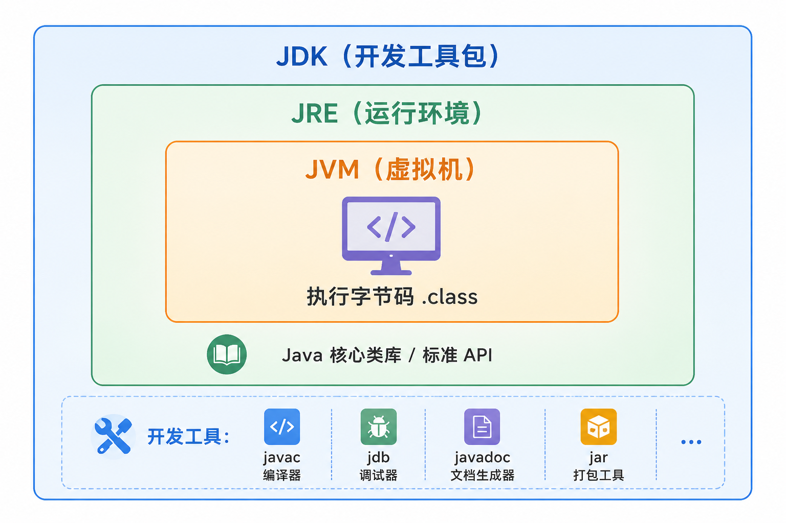
### 知识点 3.4 全局 vs 用户级环境变量文件（◆ 易错对比）
[Linux`/etc/profile`](Linux学习/Linux.md#^xqlvhn)
[Linux`~/.bashrc`](Linux学习/Linux.md#^g9e65n)

| 文件             | 作用范围         |
| -------------- | ------------ |
| `/etc/profile` | **所有用户**（全局） |
| `~/.bashrc`    | **当前用户**     |

- `export` 的作用：把普通 shell 变量**声明为环境变量**，使其对**当前 shell 及所有派生子 shell** 生效 [export](Linux学习/Linux.md#^4d8ptq)
**剖析扩展**：`/etc/` 下的配置管"全机器所有人"，`~/`（家目录）下的配置管"我自己"。给全公司配 Java 路径改 `/etc/profile`，只给自己配改 `~/.bashrc`。
### 第 4 层 · 服务载体层：Tomcat + 网络三件套（★★）

#### 知识点 4.1 Tomcat（★★）java
- **定位**：免费开源的**轻量级 Web 应用服务器**，适合中小型系统，**开发调试 JSP 的首选**。
#### 知识点 4.2 DNS 服务（★★）域名系统              [LinuxDNS](Linux学习/Linux.md#^hwmn9u)
- 域名解析其他服务器·
- **作用**：==域名↔IP 互转==。**正向**：域名→IP；**反向**：IP→域名。
- **安装**：`yum install -y bind`；**配置**：`/etc/named.conf`（监听改 `any`、允许查询 `any`、加 zone）。          **bind**            **name**
- **服务管理**：`service named restart`；**端口 53**（卷一·填空）。
- **正向解析文件**（如 `named.bob.com`）含：SOA、NS、A、MX、CNAME。
- **反向解析文件**（如 `named.172.16.5`）含：PTR。

**关键记录类型详解（◆ 易混）**：

| 记录        | 含义          | 方向  |
| --------- | ----------- | --- |
| ==**A**==     | ==域名→IP==       | ==正向==  |
| ==**PTR**==   | ==IP→域名==       | ==反向==  |
| **NS**    | 指明域名服务器     | —   |
| **MX**    | 邮件交换（邮件服务器） | —   |
| **CNAME** | 别名          | —   |
A 和 PTR 是**互逆**的一对——正向用 A，反向用 **PTR**。
#### 知识点 4.3 DHCP 服务（★★）动态主机配置协议
- 自动动态分配 IP给自己
- **作用**：自动分配 IP、子网掩码、网关、DNS，**避免地址冲突**。
- **安装**：`yum install -y dhcp`。
- **启动**：`service dhcpd restart` + `service network restart`。
- **网卡启用 DHCP**：`BOOTPROTO=DHCP（BOOTPROTO = BOOT Protocol（启动协议 / 引导协议））。`
- **动态获取/释放 IP**：`ifup`（起网卡拿 IP）/ `ifdown`（停网卡放 IP）。
#### 知识点 4.4 FTP 服务（★） 文件传输协议
- 文件传输
- 用 **vs==ftp==d**（更安全的 FTP）。安装：`yum install -y vsftpd ftp`。
- **三种认证模式（安全性递增，◆ 常考排序）**：
    1. **匿名开放**（最不安全）
    2. **本地用户**
    3. **虚拟用户**（最安全，用独立数据库文件认证）
- 管理：`service vsftpd restart` / `status`；**端口 21**。

**文件归纳**：DNS + DHCP + FTP = Web 服务器的**"网络基础设施三件套"**——**解析、寻址、传输**。
### 第 5 层  hosts
#### 知识点 5.1 /etc/hosts 静态映射（★★）
- 相互定义**本地主机名与IP 映射**的文件 = **`/etc/hosts`**。
**剖析扩展**：`/etc/hosts` 是**不依赖 DNS 的静态解析**——在本机写死"某域名=某IP"，优先级高于 DNS。搭建内网测试时常用它临时指域名，免去搭 DNS。
**文件归纳**：DNS/hosts 管"**域名解析**"，DHCP 管"**客户端自动联网**"，端口管"**服务定位**"——**网络可达三件套**，缺其一 Web 服务"看得到起不来"或"起得来访问不到"。
### 第 6 层 · 应用框架层：MVC （一种**思想/模式**）+ SSM（一套**具体工具**）（★★ ）
#### 知识点 6.1 MVC 设计模式（★★）
==**MVC = Model模型 + View视图 + Controller 控制器**==
- **Model **：业务逻辑与数据规则，可被多视图复用，减少重复代码。
- **View **：用户界面（HTML），只负责展示。
- **Controller**：接收输入、调度模型与视图，**本身不输出内容，只做路由**。
**剖析扩展**：MVC 的精髓是"**分工**"——视图只管画、模型只管算、控制器只管传话，三者互不越界，改界面不影响逻辑。

SSM 三框架 
Spring +  SpringMVC  + MyBatis
Spring 管对象（IoC/AOP），MyBatis 管数据库（持久层）
- IoC：以前对象自己 new 依赖，**现在交给 Spring 容器**"注射"进来——控制权反转
- AOP：把"日志、事务"这种横切多个方法的公共逻辑，从业务代码里抽出来"切"出去**统一管理**。
```
MVC（思想）：你应该分成 Model / View / Controller 三层
SSM（工具）：具体怎么实现这三层？
  ├── Model 层（业务+数据）→ Spring 管理 + MyBatis 查数据库
  ├── View 层 → JSP / HTML / 前端页面
  └── Controller 层 → SpringMVC 来做
```
### 第 7 层 · 运维管理层：服务 + 日志 + 软件包（★★）

#### 知识点 7.1 服务管理（★★）
- 启动脚本目录：`/etc/init.d/`
- 启动命令：`service`或 `systemctl`
#### 知识点 7.2 日志管理（★★）

| 项      | 内容                           |
| ------ | ---------------------------- |
| 日志守护进程 | **`rsyslogd`**               |
| 日志目录   | **`/var/log`**               |
| 日志分析工具 | **`logwatch`**（解析原始日志→结构化报告） |
`rsyslogd` 是"写日志的工人"（守护进程）；`/var/log` 是"所有日志的家"；`logwatch` 是"看日志的分析师"。三者分工：**采集→存储→分析**。
### 知识点 7.3 软件包管理 rpm / yum（★★★）
[rpm相关](rpm.md)
[yum相关](Linux学习/Linux.md#^s294vu)
- **软件包两大类**：**源码包**（`.tar.gz`，需编译）与**二进制包**（RPM `.rpm`、Debian `.deb`，已编译直接装）
- ==**RPM 默认可执行命令安装目录**：`/usr/bin`。==
## 横向速查表一：高频命令总表

| 目的         | 命令                                                |
| ---------- | ------------------------------------------------- |
| 启动 Apache  | `service httpd start` 或 `/etc/init.d/httpd start` |
| 改 Web 配置   | 编辑 `httpd.conf`                                   |
| 查 Java 版本  | `java -version`                                   |
| 查已装 java 包 | `rpm -qa \| grep java`                            |
| 强制卸载       | `rpm -e --nodeps 包名`                              |
| 使环境变量生效    | `source ~/.bashrc`                                |
| 注册开机自启     | `chkconfig --add 服务名`                             |
| 启动 SSH     | `service sshd start`                              |
| 生成免密密钥     | `ssh-keygen`                                      |
| 传 Web 目录   | `scp -r 本地 user@IP:远程`                            |
| 查日志        | `/var/log` 或 `logwatch`                           |
| 只编译不链接     | `gcc -c`                                          |

## 横向速查表二：服务—配置—端口—服务名 对照（★ 通杀配置题）

| 服务                      | 配置文件                 | 服务名           | 默认端口       |
| ----------------------- | -------------------- | ------------- | ---------- |
| ==**Web/Apache/HTTP**== | ==**`httpd.conf`**== | ==**httpd**== | ==**80**== |
| ==DNS==                 | ==**`named.conf`**== | ==named==     | ==53==     |
| DHCP                    | `dhcpd.conf`         | dhcpd         | —          |
| FTP                     | `vsftpd.conf`        | vsftpd        | 21         |
| SSH                     | `sshd_config`        | sshd          | 22         |
| MySQL                   | `my.cnf`             | mysqld        | 3306       |
| Tomcat                  | —                    | —             | 8080       |
| telnet                  |                      |               | 23         |

## 重点分级总览（分清重点）
- **★★★ 必背核心**：httpd 服务名与 `httpd.conf`、端口 80/8080/22/53/21/3306、`java -version`、`rpm -qa|grep`、`rpm -e/-ql/-qa` 口诀、`source` 生效、`/etc/profile` vs `~/.bashrc`、`flush privileges`、SSH 免密三件套、scp 的 `-r`、GCC 的 `-g/-o/-c`、MVC 三要素、SSM 分工。
- **★★ 重点常考**：开源阵营 vs IIS、两种启动方式等价、`/etc/init.d/`、`/var/log`+logwatch+rsyslogd、DNS 的 A/PTR 记录、DHCP 租约与 `BOOTPROTO=DHCP`、`/etc/hosts`、FTP 三种认证排序、chkconfig 自启四步、makefile 规则顺序。
- **★ 理解识记**：openJDK vs Oracle、Eclipse 配 Tomcat、部署全流程、四阶段总蓝图。
- **◆ 易错陷阱**：`service apache start`（错，应 httpd）、`jdk -version`（错，应 java）、Unity 当 Web 框架（错）、IIS 当开源（错）、`httpd.conf` 与 `named.conf` 混淆、A 与 PTR 方向混淆、makefile 目标/依赖顺序写反、scp 传目录漏 `-r`。
---
## 核心思想提炼（层层剖析后的"道"）

1. **依赖定顺序**：环境→载体→工具→应用，自底向上，不可颠倒。
2. **配置即服务**：Linux 靠文本配置文件定义一切，**会改配置 + 会重启 = 会运维**。
3. **生效要闭环**：改 `bashrc` 要 `source`、改 MySQL 权限要 `flush privileges`、改服务配置要 `restart`——**"改了不等于生效，必须通知运行中的程序重读"**，这是贯穿全文的第一隐性主线。
4. **服务化思维**：`init.d` + `chkconfig` 把程序变服务，实现开机自启与统一管理。
5. **安全隔离**：独立用户（mysql）、虚拟用户认证、SSH 加密、最小权限——安全是搭建的底色。
6. **名实要分清**：软件名≠服务名（Apache→httpd、OpenSSH→sshd），配置名各归其主（httpd.conf/named.conf/...），端口各守其位（80/8080/22/53/21）。
7. **验证成习惯**：每步配置后用命令（`java -version`、`chkconfig --list`）或浏览器（`localhost:8080`）验证，形成 **配置—生效—验证** 闭环。
---
### 7.2 SSH（Secure Shell 安全外壳协议)
1. 定义：一种**加密的网络传输协议**，为远程登录会话和其他网络服务提供**安全性**。
- 看到 SCP、SFTP -->选项里找 SSH、22端口。
- 看到 HTTPS-->选项里找 SSL/TLS、443端口、网页加密。
**SSH协议标准**是IETF制定的网络通信规则和RFC文档，它**规定了加密算法和22端口等规范**，是理论图纸；而我们在Linux里用的 **ssh**，是OpenSSH软件包提供的一个**客户端工具**，它是根据协议标准编写出来的、**真正用来执行远程登录的程序**
#### OpenSSH
1. 定义：SSH是一个协议标准，而**OpenSSH**是Linux下最常用的SSH协议实现软件。
**SSH的核心组件（架构层）**

| 组件         | 作用         | 考点                 |
| ---------- | ---------- | ------------------ |
| **sshd**   | SSH服务端守护进程 | 需要启动sshd服务才能接受远程连接 |
| ssh        | SSH客户端命令   | 用于远程登录             |
| **scp**    | 安全复制命令     | 基于SSH的文件传输         |
| sftp       | 安全文件传输     | 类似FTP但加密           |
| ssh-keygen | 密钥生成工具     | 生成公私钥对             |
tcp
 协议      默认端口                
 SSH          22 ★★★                            
 HTTP        80       HTTPS  443                  
 FTP           21     相比于scp 加密传输ftp明文传输不安全
 Telnet       23                       
 DNS         53        
 
 **记错端口 = 服务起不来或访问不到**。22/23 易混：**SSH=22（安全），telnet=23（不安全、明文）**——记忆法：SSH 比 telnet 更安全，端口号反而更小（22<23）。               

**SSH服务管理（运维层）**
- **配置文件sshd（必考点！）**

| 配置文件       | 路径                     | 作用      |
| ---------- | ---------------------- | ------- |
| **服务端主配置** | `/etc/ssh/sshd_config` | ★★★ 最常考 |
| 客户端配置      | `/etc/ssh/ssh_config`  | 较少考     |
- **服务启动与配置**

| 操作          | 命令                     | 说明               |
| ----------- | ---------------------- | ---------------- |
| **启动SSH服务** | `service sshd start`   | 注意是`sshd`不是`ssh` |
| **停止SSH服务** | `service sshd stop`    | -                |
| **重启SSH服务** | `service sshd restart` | -                |
| **开机自启**    | `chkconfig sshd on`    | -                |
**SSH远程登录（应用层）**
1. 基本登录命令
```bash
# 语法格式
ssh 用户名@服务器IP地址

# 示例
ssh user1@10.0.0.50
ssh root@192.168.1.100
```
2. 登录流程图解
```
┌──────────┐                       ┌──────────┐
│  客户端   │  ── SSH连接请求 ──→    │  服务端   │
│ (ssh)    │     加密通道建立        │ (sshd)   │
│          │  ←── 返回加密响应 ──    │          │
│          │                       │          │
│          │  ── 输入密码/密钥 ──→   │          │
│          │  ←── 验证成功，登录 ──  │          │
└──────────┘                       └──────────┘
```
**SSH文件传输（扩展层）**
1. SCP命令（Secure Copy）==**SCP是基于SSH的安全文件传输命令**==

| 操作             | 命令格式                     | 示例                                     |
| -------------- | ------------------------ | -------------------------------------- |
| **上传文件**       | `scp 本地文件 用户@IP:远程路径`    | `scp test.c user1@10.0.0.50:/tmp/`     |
| **下载文件**       | `scp 用户@IP:远程文件 本地路径`    | `scp root@10.1.0.2:/opt/www/ /opt/`    |
| **上传==目录-r==** | `scp -r 本地目录 用户@IP:远程路径` | `scp -r /opt/www/ root@10.1.0.2:/opt/` |
| **下载目录**       | `scp -r 用户@IP:远程目录 本地路径` | `scp -r root@10.1.0.2:/opt/www/ /opt/` |
**SSH免密登录（进阶层）**
1. 免密登录原理（公私钥认证）
免密原理 = "**锁和钥匙**"。`ssh-keygen` 生成一对：私钥（自己留，是钥匙）、==公钥（给别人，是锁==）。把公钥放进服务器的 `authorized_keys`（=在服务器上装好这把锁），以后客户端用私钥（钥匙）一开就进，无需密码。
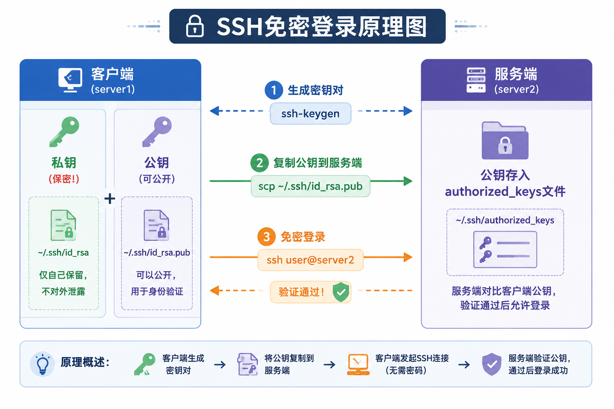
2. 免密登录完整操作步骤
#### 步骤1：==生成密钥对==

```bash
ssh-keygen
```
- 会在 `~/.ssh/` 目录下生成两个文件：
    - `id_rsa`：私钥（必须保密！）
    - `id_rsa.pub`：公钥（可以公开）
==所以密钥存于 **`~/.ssh`** 目录==
#### 步骤2：密钥存储位置

|文件|路径|说明|
|---|---|---|
|私钥|`~/.ssh/id_rsa`|客户端保存，绝不外泄|
|公钥|`~/.ssh/id_rsa.pub`|复制到服务端|
|授权文件|`~/.ssh/authorized_keys`|服务端保存所有允许的公钥|

#### 步骤3：复制公钥到服务端

```bash
# 方法1：手动复制
scp ~/.ssh/id_rsa.pub user2@server2:~/.ssh/

# 方法2：使用ssh-copy-id（更简单）
ssh-copy-id user2@server2
```
#### 步骤4：服务端配置

```bash
# 登录服务端后，将公钥追加到authorized_keys
cat id_rsa.pub >> ~/.ssh/authorized_keys
```

**（总结）题目**：配置在server1上以用户名user2免密登录到server2
   ==把客户端**公钥**追加进服务器的 **`authorized_keys`** → 免密==
   **远程部署标准动作链**：`ssh-keygen` → 公钥写 `authorized_keys`（免密）→ `scp -r` 传 Web 工程 → `ssh` 登录 → `service httpd start`。

**答案**：

```bash
# 步骤1：生成密钥
ssh-keygen

# 步骤2：进入密钥目录
cd ~/.ssh

# 步骤3：复制公钥
scp id_rsa.pub user2@server2:/home/user2/.ssh/

# 步骤4：服务端追加到授权文件
cat id_rsa.pub >> authorized_keys
```

- 关键文件总结

|文件名|位置|作用|
|---|---|---|
|**id_rsa**|客户端 ~/.ssh/|私钥文件|
|**id_rsa.pub**|客户端 ~/.ssh/|公钥文件|
|**authorized_keys**|服务端 ~/.ssh/|存储所有授权的公钥|
|**known_hosts**|客户端 ~/.ssh/|存储已连接过的主机指纹|

### 综合应用题精选

**题目1**：用户用scp命令把文件上传至IP地址为10.0.0.50的服务器的/tmp目录下，用户名user1

**答案**：

```bash
scp /tmp/target/test.c user1@10.0.0.50:/tmp/
```

**题目2**：使用ssh以user1身份登录服务器

**答案**：

```bash
ssh user1@10.0.0.50
```
**SSH知识点思维导图**
```
SSH (Secure Shell)
│
├── 基础概念
│   ├── 全称：Secure Shell（安全外壳协议）
│   ├── 本质：加密的网络传输协议
│   └── 作用：为远程登录提供安全性
│
├── 核心组件 (OpenSSH)
│   ├── sshd - 服务端守护进程
│   ├── ssh - 客户端命令
│   ├── scp - 安全文件传输
│   └── ssh-keygen - 密钥生成
│
├── 端口与配置
│   ├── 默认端口：22
│   ├── 服务端配置：/etc/ssh/sshd_config
│   └── 服务管理：service sshd start/stop/restart
│
├── 远程登录
│   └── 命令：ssh 用户名@服务器IP
│
├── 文件传输 (SCP)
│   ├── 上传：scp 本地文件 用户@IP:远程路径
│   ├── 下载：scp 用户@IP:远程文件 本地路径
│   └── 目录传输：加 -r 参数
│
└── 免密登录
    ├── 原理：公私钥认证
    ├── 生成密钥：ssh-keygen
    ├── 密钥位置：~/.ssh/
    │   ├── id_rsa（私钥）
    │   ├── id_rsa.pub（公钥）
    │   └── authorized_keys（授权公钥）
    └── 配置步骤：生成→复制→追加到authorized_keys
```
