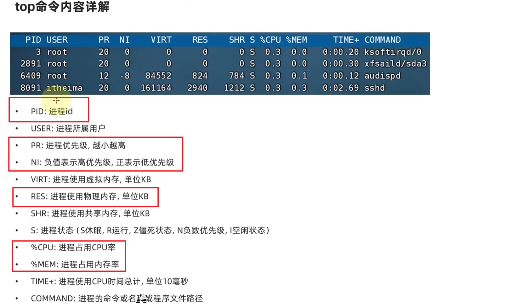

## 第四章
### 1. 各类快捷键小技巧
-  Ctrl + c ：
	1. 强制停止命令的运行（运行后）（如：输入tail后）
	2. 取消当前命令的输入（没运行前）
-  Ctrl + d :
	1. 退出或登出某个用户
	2. 退出某些特定程序的页面==（不能用于vi/vim的退出）==
#### 1.1 与历史命令相关的：
- history ：查看历史命令（越在下面的命令越新）
- ！+相关命令的前缀，自动匹配第一个与相关命令的前缀相同的命令（从histroy的最底下开始匹配），适用于再次调用最近输入的命令
- Ctrl + r ：按下之后，前面用户会变为……search。输入关键词（从histroy的最底下开始）搜索历史命令
#### 1.2 光标移动：
- Ctrl + a | e ：光标移动到命令的开始/结束
- Ctrl + 左右箭头 ：左右跳单词
- Ctrl + l/ clear：清屏
### 2. 软件安装
#### 2.1 yum命令
1. yum ==需要root权限==，需要联网
2. 在centos系统中：
语法：
  ```
  yum [ -y ] [ install | remove | search ] 软件名称
  例：yum -y install wget
  ```
- 选项：==-y== 自动确认，无需手动确认安装或卸载过程
### 3. systemctl命令
1. 能够被systemctl管理的软件，一般也成为：服务
2. systemctl作用：可以控制软件（服务）的启动、关闭、开机自自动
	- 系统内置的服务（NetworkManager，主网络服务；network，副网络服务；firewalld，防火墙服务；sshd，ssh服务，finalshell远程登录）均可被systemctl控制
	- 第三方软件，如果==自动==注测了可以被systemctl控制
	- 第三方软件，如果没有自动注册，可以手动注册
3. 语法：
```
systemctl start（启动） | stop（关闭） | status（服务状态） | enable（开机自启） | disable（关闭开机自启） 服务名
```
### 4. 软连接
- 可以将文件、文件夹链接到其他位置，链接只是一个指向，并不是物理移动，类似于Windows的快捷方式
- 普通用户即可执行这一命令
#### 4.1 ln命令创建软链接
语法：
```
ln -s 参数1 参数2
例： ln -s etc/yum.conf ~/yum.conf（在新路径下应该创建这个新文件）
```
- -s选项，创建软链接
- 参数1和2 表示文件路径，即把参数1对应的文件链接去参数2的地方
- 通过软链接 cat 也可以读取文件内的内容
### 5. 日期和时区
ps：命令中参数如果有空格，可以用引号把参数包裹住
#### 5.1 date命令
1. date命令可以==查看日期时间==，并可以==格式化显示形式==以及做==日期计算==
2. 语法：
```
date [ -d ] [+格式化字符串]
例：date  -d  "-1 month"  +"%Y|%y %m %d  %H %M %S|%s"
```
- %Y : 年
- %y :年份后两位 00-99
- %m:月 01-12
- %d :天 01-31
- %H :时 00-23
- %M :分 00-59
- %S :秒 00-60
- %s :自1970-01-01 00:00:00 UTC(第一时区)到现在的秒数
3. 如何修改时区：
```
rm -f /etc/localtime
sudo ln -s /usr/share/zonrinfo/Asia/Shanghai /etc/localtime
```
4. ntp的作用：自动联网同步时间
### 6. IP地址和主机名
#### 6.1 IP地址
1. IP地址是==每一台联网的电脑都会有的一个地址 用来和其他的计算机进行通讯==
2. 版本：ipv4，ipv5，ipv6，下面主要以ipv4为例
3. 格式：==a.b.c.d== abcd都是0-255的数字
4. 主网卡ens33
5. 127.0.0.1这个ip地址指代==本机==
6. 0.0.0.0 可以指代==本机==  可以在某些端口绑定中确定关系  可以在一些IP地址的限制中，表示所有IP。如放行设置为0.0.0.0表示为允许任意IP访问
#### 6.2 主机名
1. hostname 查看主机名
2. hostnamectl set-hostname 要修改的主机名  修改主机名（需要root）
3. 
	在@后面的就是主机名
#### 6.3 域名解析（主机名映射）
1. 我们访问百度时，www.baidu.com，是百度的网址 我们称为域名
2. 域名解析过程（由域名得到IP的过程）：

### 7. 网络请求和下载
#### 7.1 ping命令
1. 查看指定的网络服务器是否是可联通的状态，就是看能不能访问或者联网
2. 语法：
```
ping [ -c num ] ip或主机名
例：ping -c 3 baidu.com == ping 198.18.0.19
```
- 选项：-c 。检查的次数，不使用-c，则无限次持续检查
- 参数：ip或主机名，被检查的服务器ip或主机名地址
- 联通-->则显示的时间会很短，例如8ms
#### 7.2 wget命令
1. 非交互式的文件下载器，可以在命令行内下载网络文件，相当于将别人的网盘里的文件拷贝到自己的本地硬盘，而yum更像一个应用商店。
2. 语法：
```
wget [ -b ] url
例：
wget -b http://archive.apache.org/dis/hadoop/common/hadoop-3.3.0/hadoop-3.3.0.tar.gz
```
==可以通过tail命令监控后台下载进度：tail -f wget-log==
- 选项：-b 可选。后台下载，将下载日志写入到当前工作目录的wget-log文件
- 参数：url，下载链接
- ==注意：无论是否下载完成，都会生成要下载的文件==
#### 7.3 curl命令
1. 可以发送http网络请求，==相当于打开浏览器利用网址进行搜索==（只能得到html的源码，不能渲染），可用于：下载文件，获取信息
2. 语法：
```
curl [ -O（大写）] url
例：
curl -O http://archive.apache.org/dis/hadoop/common/hadoop-3.3.0/hadoop-3.3.0.tar.gz
```
- 选项：-O，用于下载文件，当==url是下载链接==时，可以使用此选项保存文件
- 参数：url，发起请求的网络地址
### 8. 端口
1. 设备与外界进行交流的==出入==口（有两个。发送端，接收端），分为物理端口（又称接口，如USB接口）和虚拟端口（计算机内部的端口，==是不可见的==，是用来==操作系统和外界==进行交互使用的）
2. 计算机程序之间的通信，==通过IP只能锁定计算机==，无法锁定计算机内的程序。==但通过端口可以锁定计算机上的具体程序。==IP相当于小区地址，而小区内住户的门牌号就相当于端口
3. IP+进程： a.b.c.d ：进程号
4. Linux中：
	- 公认端口：1-1023，通常被系统内置或者一些知名的程序预留使用，如SSH服务的22端口。非特殊需要不占用这个范围的端口。
	- 注册端口：1024-49151，通常随意使用==（用户自定义）==，用于松散的绑定一些程序\服务
	- 动态端口：49152-65535，通常不绑定固定的程序。而是当程序==对外进行网络连接时，用于临时使用（多用于出口）。==
#### 8.1 nmap命令
1. 查看==指定IP==对外的暴露端口

2. 语法：
```
nmap 被查看的IP地址
==>nmap 被查看的IP地址 | grep 查找的信息
```
#### 8.2 netstat命令
1. 查看==本机指定==端口占用情况

	可以看到111端口被程序（进程号）1占用了，其中0.0.0.0:111表示端口111被绑定在0.0.0.0这个IP上，表示允许被外界访问。
2. 语法：
```
netstat -anp |grep 查找的端口号或者进程
```
### 9. 进程管理
1. 进程是指程序在操作系统内运行后被注册为系统内的一个进程，==方便系统管理程序的运行。==并拥有独立的进程ID（进程号）
### 9.1 ps命令
1. 查看进程信息
2. 语法：
```
ps [ -e -f ]
ps [ -e -f ]|grep 指定进程
例：ps -ef|grep tail
```
- 选项：-e 显示出全部进程，-f 以完全格式化的形式展示全部信息
- ```ps -ef``` 列出全部进程的全部信息 
 - UID：进程所属用户id
 - PID：进程的进程号
 - PPID：此进程的父id（启动此进程的其他进程）
 - C：进程的CPU占用率（百分比）
 - STIME：进程的启动时间
 - TTY：启动此进程的终端序号，如显示？，表示非终端启动
 - TIME：进程占用CPU时间（累计）
 - CMD：进程的启动命令或启动路径
#### 9.2 kill命令
1. 关闭进程
2. 语法
```
kill [ -9 ] 进程ID
```
- 选项：-9 ，可选，表示强制关闭进程。不使用此选项会向进程发送信号要求关闭，但是是否关闭要看进程本身的处理机制
### 10. 主机状态监测
#### 10.1 top命令
1. 类似于Windows的任务管理器，查看CPU、内存、进程的信息
2. 语法：直接输入```top```即可，其页面每5秒刷新一次，按q或Ctrl+c退出
3. 输出信息：


#### 10.2 df命令
1. 查看磁盘的使用率
2. 语法：
```
df [ -h ]
```
- 选项：-h，以更加人性化的单位显示

#### 10.3 iostat命令
1. 查看磁盘速率等信息
2. 语法：
```
iostat [ -x ]  [ num1 ]  [ num2 ] 
```
- 选项：-x 显示更多信息
- num1：数字，刷新间隔，num2：数字，刷新几次。二者都不写，磁盘信息只显示一次。
```iostat -x```得到信息：

#### 10.4 sar -n DEV 命令
1. 查看网络情况
2. 语法：
```
sar -n DEV num1 num2
```
- 选项：-n（net） ,查看网络，DEV表示查看网络的接口
-  num1：数字，刷新间隔（不填就查看一次结束），num2：数字，刷新几次（不填就无限次）。

rxkB：网卡每秒读取了数据包的大小（kb）
txkB：网卡每秒发送了数据包的大小（kb）

### 11. 环境变量
1. 学习的一系列命令本质上是一个个可执行程序，例：cd命令本质是：/usr/bin/cd
2. 环境变量是一种keyvalue型结构，例如：PWD=/root。key是PWD，value是/root
#### 11.1 env命令
1. 查看环境变量
2. 语法：直接env即可
#### 11.2 PATH
**PATH=/usr/local/sbin:/usr/local/bin:/sbin:/bin:/usr/sbin:/usr/bin:/root/bin**
1.  之所以无论什么工作目录都能执行cd命令，是因为有PATH这个项目的值来做的。
2. PATH记录了系统执行任何命令的搜索路径：
	- /usr/local/sbin
	- /usr/local/bin
	- /sbin
	……
	当执行任何命令的时候，都会按照顺序，从上述路径中搜索要执行程序的本体
	比如执行cd命令时，就从第二个目录/usr/local/bin中搜索到cd命令
#### 11.3 $符号
1. 在Linux系统中,$被用于取==环境变量中==变量（key）的值（value）。例如:
```
echo $cd
无输出
echo $PATH
输出：PATH=/usr/local/sbin:/usr/local/bin:/sbin:/bin:/usr/sbin:/usr/bin:/root/bin
```
2. 在环境变量中变量（key）的值（value）后进行拼接-->当和其他内容混合在一起时，用{}来标注变量是什么（以PATH为例）
```
echo ${PATH}/abc
输出：PATH=/usr/local/sbin:/usr/local/bin:/sbin:/bin:/usr/sbin:/usr/bin:/root/bin/abc
```
#### 11.4 自行设置环境变量
1. 临时设置，语法：```export 变量名=变量值 ```
2. 永久设置：
	- 只针对当前用户生效，配置在当前用户的：==~==/==.==bashrc 文件中
	
	```[xy@centos ~]$ source ~/.bashrc```
	
	- 针对所有用户生效，配置在系统的：/etc/profile 文件中==(需要root权限）==。
	- 最后两者生效需要：通过语法：source 配置文件（/etc/profile或~/.bashrc ），立即生效。或重新进入finalshell
3. 自定义环境变量PATH：
```
	[root@centos ~]# mkdir myenv
	[root@centos ~]# ls
	anaconda-ks.cfg  myenv  original-ks.cfg
	[root@centos ~]# cd m*
	[root@centos myenv]# ls
	mkha
	[root@centos myenv]# vim mkha
	echo "哈哈哈哈"
	[root@centos myenv]# ls -lah
	total 16K
	drwxr-xr-x. 2 root root  35 Jul 10 03:37 .
	dr-xr-x---. 6 root root 248 Jul 10 03:37 ..
	-rw-r--r--. 1 root root  19 Jul 10 03:37 mkha
	-rw-r--r--. 1 root root 12K Jul 10 03:33 .mkha.swp
	[root@centos myenv]# chmod 755 mkha
	[root@centos myenv]# ls -lah
	total 16K
	drwxr-xr-x. 2 root root  35 Jul 10 03:37 .
	dr-xr-x---. 6 root root 248 Jul 10 03:37 ..
	-rwxr-xr-x. 1 root root  19 Jul 10 03:37 mkha
	-rw-r--r--. 1 root root 12K Jul 10 03:33 .mkha.swp
	[root@centos myenv]# ./mkha
	哈哈哈哈
	[root@centos myenv]# vim /etc/profile!
```

```
	[root@centos myenv]# source /etc/profile
	[root@centos myenv]# echo $PATH
	/usr/local/sbin:/usr/local/bin:/sbin:/bin:/usr/sbin:/usr/bin:/root/bin:/root/myenv
	[root@centos myenv]# mkha
	哈哈哈哈
```

### 12. Linux文件上传和下载
1. 拖拽：
	- Linux-->Windows后找到fsdownload就行
	
	-  在finalshell中登录root用户（在finalshell设置页面输入root及密码就行）
	-  Windows-->Linux直接拖到相应的目录即可
2. rz和sz命令：
	- rz：上传（windows-->Linux)，语法：直接rz在弹窗中找到要上传的文件
	- sz：下载（Linux-->windows)，语法：sz 要传给Windows的文件

### 13. 压缩和解压
1. 格式：zip，tar，gzip
2. .tar文件(归档文件）：将文件简单的组装到.tar文件中。文件体积大小并没有太多减少。
3. .gz文件（gzip压缩文件）：后缀为.tar.gz或.gz。会大大减少文件体积
#### 13.1 tar 命令压缩
1. 语法：
```
tar -cvf 文件1.tar 文件2 文件3……
tar -zcvf 文件1.tar.gz 文件2 文件3……
```
2. 两个语法都是将文件2与文件3压缩到文件1中，只是第二种运用gzip模式压缩。
3. 选项：-c 创建压缩文件，用于压缩模式。-v 显示压缩，解压过程。用于查看进度。-f 要创建的文件或要解压的文件，并且-f选项要处于最后一个。-z 启用gzip模式，用该选项时要处于第一个。
#### 13.2 tar命令解压
1. 语法：
```
tar -xvf 文件1.tar -C 指定路径
tar -zxvf 文件1.tar.gz -C 指定路径
```
2. 两个语法都是将文件2与文件3解压到文件1中，只是第二种运用gzip模式解压。
3. 选项： -x 解压模式。 -C 单独使用，和解压所需要的其他参数分开
#### 13.3 zip命令压缩
1. 语法：
```
zip [ -r ] 参数1.zip 参数2 ……参数n
例：zip -r test.zip test test.txt
```
2. 选项：-r 被压缩的目标文件中包含文件夹的时候，需要用-r选项。与rm、cp等命令效果一致
#### 13.4 unzip命令解压zip文件
1. 语法：
```
unzip [ -d ] 参数
例：unzip test.zip -d /home/xy
```
2. 选项：-d 指定要解压去的位置，同tar命令的-C选项
3. 参数，要被解压的zip压缩包文件
- 解压时，有同名的文件时，解压出来的文件会覆盖原文件
