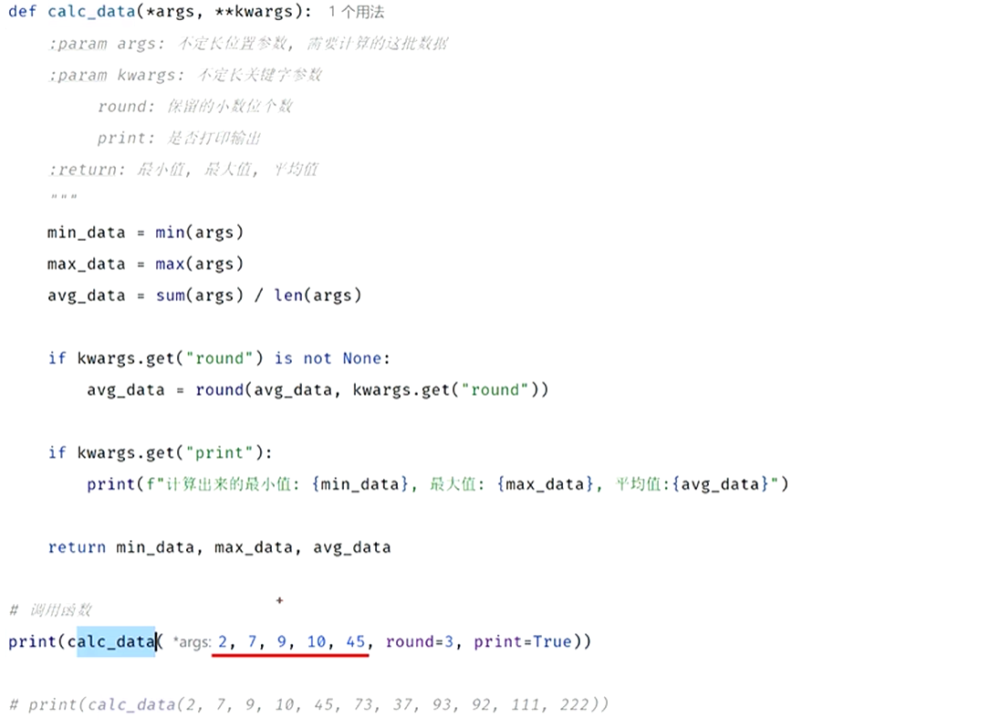
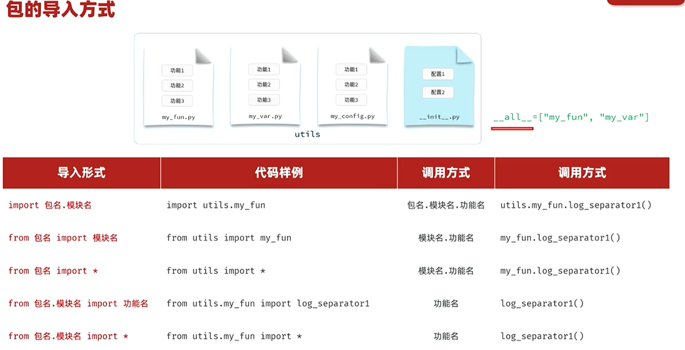

# 第一章 函数进阶
1. 位置传参（参数顺序）、关键字传参（键等于值，无顺序）二者混用时，关键字参数在位置参数之后
2. 默认参数（缺省参数）放在正常参数之后，可在传参时被修改
3. 传参时每个参数都要传递。
4. 不定长参数：二者混用时，先位置传参后关键字传参
	1. 基于位置传参：不定长位置参数`def calc_data(*args)`args可以接受多个值，形成==元组类型的数据==。（点奶茶这一主要的数据）
	2. 基于关键字传参：不定长关键字参数`def calc_data(**kwargs)`   kwargs可以接受多个值，形成字典类型的数据。通过kwargs.get（）获取键对应的值。（点完后加冰，加糖的选项）

5. 传递的参数可以是函数类型的
```python
def add (a,b):
	return a+b
def substract (a,b):
	return a-b
def calc (x,y,oper):
	return oper(x,y)
print(calc(x,y,add))
```
6. 匿名函数/命名函数
```python
a = lambda 参数列表 : 函数体
a()
-------------------------------------------
def 函数名(参数列表):
	函数体
	return
a = 函数名(参数列表)
```
7. // 是整除，得到整数。
8. python中没有double，float可以兼容int
9. 示例加类型注解：
```python
#类型注解 -> 变量: 数据类型                                  -> 标明返回值类型
#arg: tuple[tuple [str,int|float,int]]
#函数内*args是arg中每个元素的类型
def cost(*args: tuple [str,int|float,int],youhui,score = 0) -> float|int:
	a = [good[1]*good[2] for good in args]
	total = sum(a)
	if total >= 5000 and youhui < total :
		total = total - youhui
	if total >= 5000 and score // 100 < total :
		total = total -  score //100;
	return total

res = cost(("鼠标",88,2),("键盘",388,1),youhui = 100 score = 100)
print(res)
```
10. Python模块：
```Python
# 导入模块
improt 模块名 as 别名
```
11. 每一个模块都是一个Python文件，模块的名字就是Python文件的名字
12. 变量名大写相当于常量。
13. _ _ name _ _ :Python中的内置变量。所以不需要提前赋值。_ _ name _ _ 在本模块运行时返回字符串"_ _ main _ _ "，在其他模块中运行时返回所在模块的模块名称。 用于测试模块中的函数是否可用。`if __name__ == "__main__"： 测试函数`
14. _ _ all _ _ = \[ ]，指定from … import * 导入的内容
15. 导入软件包：
	1. 
	2. `__init__.py`文件加入一个普通文件夹就可以让这个文件夹变为包，这个文件可以说明作者，版本……
	3. 注意：在使用`from 包名.模块名 import *`时，需要在`__init__`文件中加上`__all__ = [模块1,模块2…]`来说明
	4. from后面加的是路径
# 第二章
1. 面向过程：把一个需求分解成一系列要执行的步骤，然后按照步骤依次执行这些任务
2. 面向对象：把一个人或物的特征（属性）和功能（方法）打包到一起，是面向对象编程的基本单元
3. 对象：把相关的**零散**的数据和方法组织为一个**整体**来对待，用类（模版）来刻画的实例
4. 面向对象：利用对象进行软件开发
5. 类：一个类来描述对象，其中属性是类中的变量（成员变量）
	- 同一类事物的属性必须是一致的
6. 定义类（大驼峰）属性的语法：==# 可以动态的添加属性==
```Python
class 类名:
	pass

对象名 = 类名()
对象名.属性名 = 属性值
# 可以动态的添加属性
```
推荐：
```python
class Car:
	def __init__(self,c_brand,c_name,c_price):
		self.brand = c_brand
		self.name = c_name
		self.price = c_price
c1 = Car("bmw","x5",500000)
print(c1.__dict__)
print(c1)        #输出的是对象的内存地址
```
7. `__dict__`是Python中自定义类的一个特殊的属性，用字典的形式==存储对象的所有属性==
8. `__init__`初始化方法，对象创建后自动调用，设置对象的初始属性
9. self 不用传递，表示当前创建的实例对象`c1`
10. 定义类的方法，传递参数和函数一致
```python
class Car:
	def __init__(self,c_brand,c_name,c_price):
		self.brand = c_brand
		self.name = c_name
		self.price = c_price
	def total_cost(self,discount):
		return self.price*discount
c1 = Car("bmw","x5",500000)
print(c1.__dict__)
total = c1.total_cost(0.9)
print(total)
```
11. 魔法方法：以双下划线开头和结尾的特殊方法，用于定义类的特殊行为，不需要我们手动调用，python在合适时机自动调用。主要有：`__init__ __str__ __eq__ __lt__ __le__   __gt__ __ge__`
```python
class Car:
	def __init__(self,c_brand,c_name,c_price):
		self.brand = c_brand
		self.name = c_name
		self.price = c_price
	def runnig(self):
		print("...")
	def __str__(self):
		return f"{self.brand}{self.name}{self.price}"
	def __eq__(self,other):
		return self.price == other.price and self.brand == other.brand and 
		self.name == other.name
	def __lt__(self,other):
		return self.price < other.price
c2 = Car("bmw","x5",500000)
print(c2.__dict__)
c1 = Car("bmw","x5",500000)
print(c1.__dict__)
print(c1) # 自动调用 __str__
 bmw x5 500000
print(c1 == c2)# 自动调用 __eq__
True
print(c1 < c2)# 自动调用  __lt__
False
```
12. 实例属性：每个实例具有的属性，每个实例都是独立的
13. 类属性：所有实例共享的，例：
```python
class Car:
	wheel = 4 # ---------------------------------------- >  类属性
	def __init__(self,c_brand,c_name,c_price):           (通过 类名.属性 操作)或(通过                                                          实例对象.属性 操作)
		self.brand = c_brand
		self.name = c_name     # ----------------------- >  实例属性
		self.price = c_price                             (通过 实例对象.属性 操作)
c1 = Car("bmw","x5",500000)
print(c1.__dict__)
print(c1)        
```
14. 封装：将现实世界事物在类中描述为属性和方法
15. 私有成员：在变量或方法名前以`__`开头。类对象无法访问私有成员，类中其他成员可以访问
16. 继承：
```python
class 类名(父类1名,父类2名,父类3名...):
	类内容体
```
17. 当多个父类中有名字相同的成员变量或方法，根据父类传入的顺序调用一次变量或方法即可
18. 复写：子类继承父类的成员属性和成员方法后，如果不满意，可以进行复写。即在子类中重新定义同名的属性或方法
19. 在复写后，想要再次调用父类成员
```python
父类名.成员变量或方法(self) # 普通调用方法时可以不加self
super().成员变量或方法()
```
# 第三章
1. 异常处理：
```python
try:
	有问题的代码
	...
except Exception as e:
	print("有错，错误为:",e)
	...
finally:
	无论程序是否正常运行，都会执行。即使是报错了，也会执行，不会终止。
```
2. 异常传递就是在函数调用中层层上报，直到被处理，或者程序崩溃。在主程序中集中处理异常